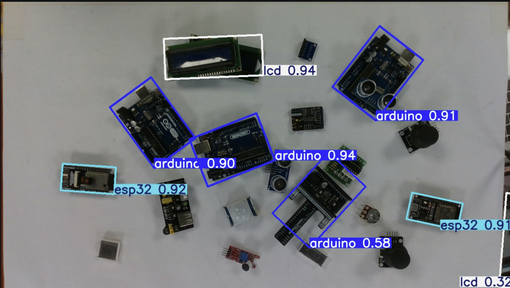
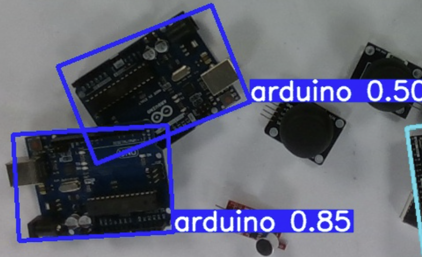
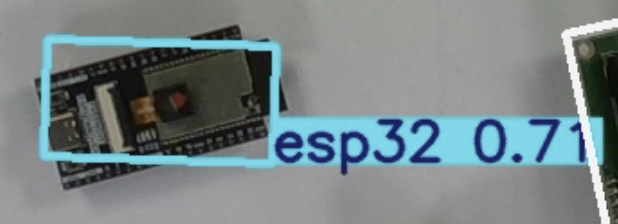
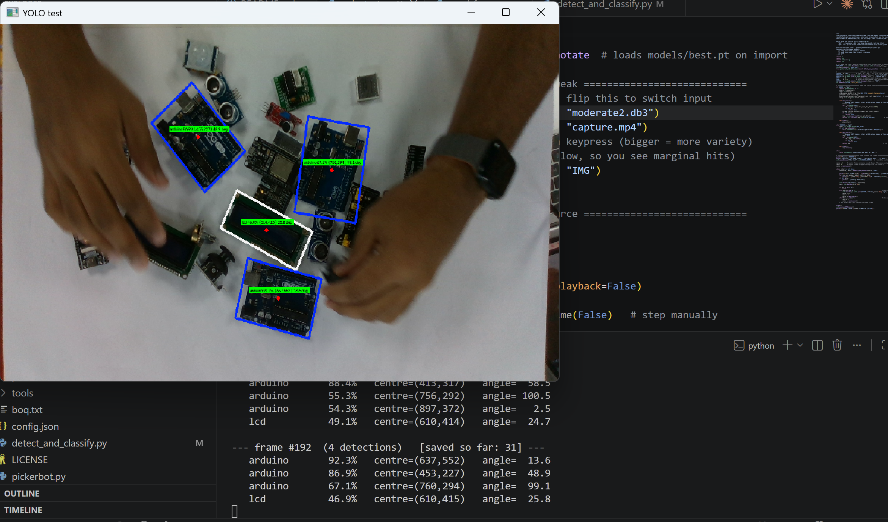

# Testing the legacy YOLO, and building a new dataset

*[Previously,]() the mount went in leaving me at the YOLO handoff. This entry is the first half of that: seeing how the *old* detector copes with the new problem, and then building the dataset for a detector that actually can.*

## Starting from the legacy model

I went to the lab, Aman was there too to put the **legacy YOLO** through its paces before committing to a new one.

Some context on that legacy model: it was trained to detect just **three classes — LCD, Arduino, ESP** with other microelectronic modules scattered in as noise, and crucially every part was laid **flat, with no overlapping**. This project deliberately introduces overlapping and stacking, so I already knew I'd need a newer, better model. But I tested the legacy one just in case, to see where it breaks.

As expected, it **can't detect overlapped modules**, and the **ultrasonic class is missing** entirely (it was never trained on it). Here's a sample:

I'll admit I was pleasantly surprised the legacy model worked at all under a completely new lab environment. On flat, separated parts it still detects correctly though the **OBB has a hard time drawing a clean orientation** around the modules. A couple of samples:

> The legacy detector was built for a **flat, one-part-per-place** world. It generalises just enough to prove it isn't the right tool for a **pile** which is exactly the case for training a new model on overlapping, stacked scenes.

## Building the new dataset

Time to get cracking. I pulled up a Python helper script that **automatically captures frames** as I shuffle the workspace, grabbing one every **30 frames** while *simultaneously* running the legacy YOLO on the live feed, just to watch how it does on overlapping modules. (Spoiler: it didn't detect them.)

My target for the dataset: roughly **80–90 images of evenly spaced parts** and about **110 of overlapping and stacked** arrangements but deliberately **not too interlocked**, keeping in line with the scoped out entanglement boundary.

It took a while, but I ended up with **207 images** to annotate and train a new YOLO from.

## Two things I noted along the way

A couple of practical observations from the session:

- **`.db3` recordings are storage heavy.** Just a couple of seconds can produce a whole **gigabyte** of `.db3`. Worth keeping in mind for how I capture going forward.
- **The RealSense Viewer beats the plain Windows camera app.** Because of that storage cost I tried grabbing frames through the Windows Camera app instead and the difference in image quality is striking. I suspect it's because the RealSense Viewer is better optimised for a native RealSense camera (its filters and processing).

*Look closely — the right-side (Windows Camera) capture is blurrier and lacks the detail of the RealSense Viewer capture on the left.*

## Where this leaves me

The legacy model is confirmed as the wrong tool for a pile whihc is a useful negative result  and I have a fresh 207 image dataset spanning evenly spaced, overlapping, and stacked scenes, ready to label.

**Next:** annotate the 207 images and train the new YOLO-OBB model.
