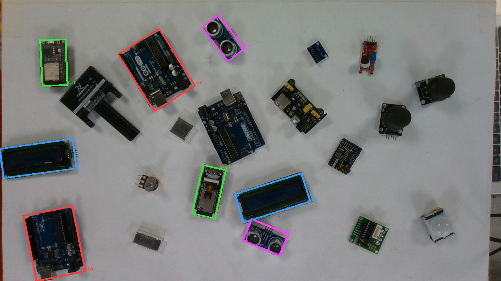
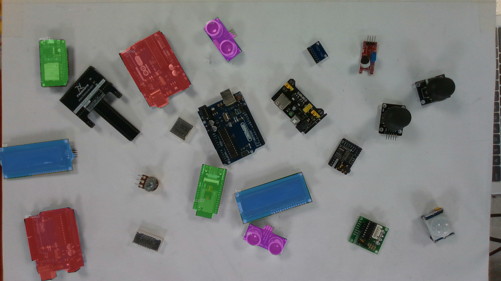

# Annotating the dataset and a pivot from OBB to instance segmentation

*[Previously,]() I captured 207 images and confirmed the legacy detector can't handle a pile. This week I set out to annotate that dataset and in the process found a better representation than the oriented boxes I'd planned on.*

## The annotation problem

This week went into making the dataset. There are **207 images, 4 classes**, and each image can carry up to **two of the same class** so you can imagine how much labelling time that is.

I went looking for the right annotation tool. For the legacy PickerBot I'd used **CVAT**, but even 50 images took a long time there, so I wanted alternatives. I looked at **Roboflow, X-AnyLabeling, and LabelImg**. Since Roboflow is well known in the community I explored that first and struck gold: **instance segmentation**.

## Why segmentation, not just OBB

Instance segmentation labels **every pixel that belongs to each individual object** not just a box around it, but the exact silhouette, with a *separate* mask for each instance, even two of the same class. And the more I looked, the more it seemed like the genuinely *better* choice:

- **It's a superset of what OBB gave me.** From a mask I can still recover the centroid and the orientation (via `cv2.minAreaRect` on the mask contour) so I don't lose the pick-point and grasp-yaw the OBB provided. I gain the mask on top.
- **It makes the depth fusion much cleaner.** My pipeline samples the height map *inside each detection* to get the part's top-surface height and pick point. An oriented box still includes table pixels and bits of neighbouring parts at its corners, so that height sample gets contaminated worst exactly in clutter. A mask samples only the object's *own* pixels, so the top-surface height and centroid are genuinely that part's. Cleaner topmost-first ranking, cleaner pick point.
- **It separates overlapping instances properly.** Two rectangles over overlapping boards share pixels ambiguously; two masks cleanly say "these pixels are the Arduino, those are the ESP32."

Roboflow also provides **SAM (Meta's Segment Anything model)** for assisted labelling, which made the annotation work far easier.

## Seeing the difference

Here's the comparison that sold me. This first image is the **YOLOv8-OBB** style boxes around the classes you can see the bounding boxes include a little of the white workspace, leaking through at the corners:



And this one is the **segmentation mask** much better, because it masks only the parts themselves and doesn't pull in those small areas of workspace:




## "But what about the gripper's orientation?"

The obvious worry: now that I'm pivoting away from OBB, how does the end effector know how to orient its grippers? In the legacy system the OBB gave the gripper its orientation to pick a module so where does that come from here?

The reassuring answer is that I don't lose orientation at all I recover it *from the mask*, and it's strictly a superset of what the OBB gave me. An oriented box is just a rotated rectangle, and the mask contains that rectangle. So from each segmentation mask I fit the rotated rectangle back out:

```python
# mask (from YOLO-seg) -> contour -> rotated rectangle
rect = cv2.minAreaRect(contour)      # ((cx, cy), (w, h), angle)
```

And there's a bonus over the OBB: the mask gives a **more reliable grasp centre** for odd or partially-occluded shapes the mask centroid is guaranteed to sit *on* the object, whereas a rotated-box centre can land in a gap and it's the *same* mask I use for clean depth sampling. So one representation now feeds both the grasp pose *and* the height / topmost-first logic.

> **For the report:** grasp pose (centroid + yaw) is recovered from the segmentation mask via its minimum-area rectangle, so the mask *subsumes* the oriented box while additionally enabling per-object depth sampling.

## Where this leaves me

A cleaner plan than I started the week with: instance-segmentation masks give me tighter detections, uncontaminated depth sampling, honest separation of overlapping parts, *and* the grasp orientation I thought I'd need OBB for ,all from one representation.

**Next:** finish annotating the 207 images as masks and train the YOLO-seg model.
