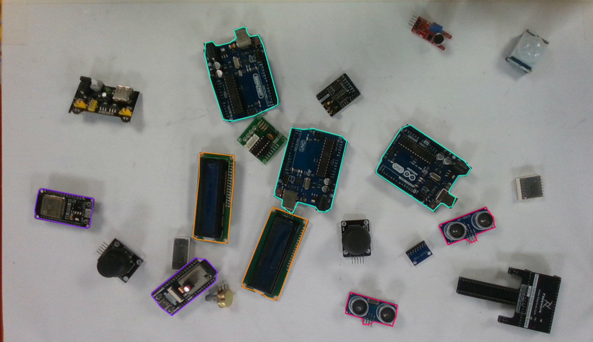
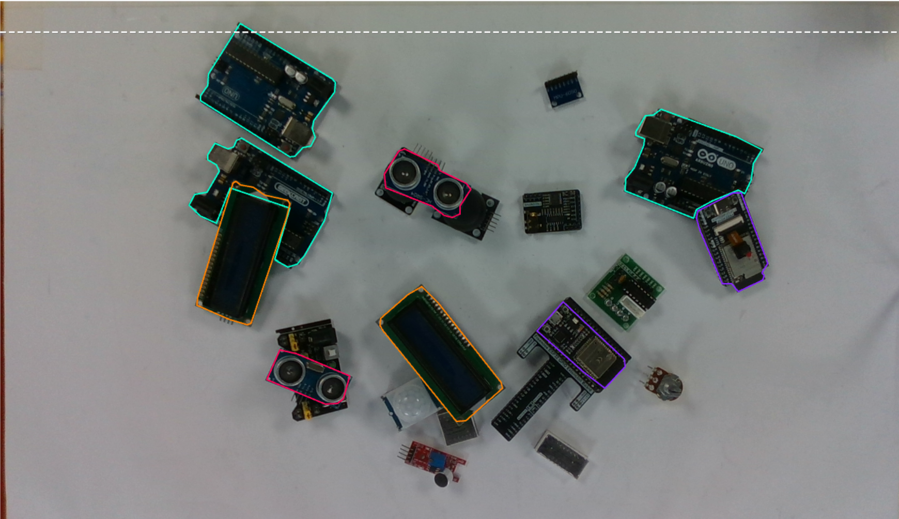
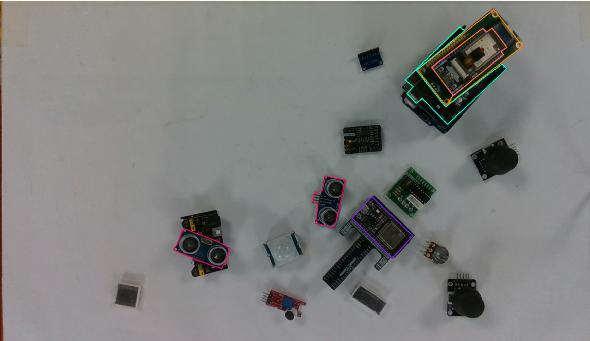
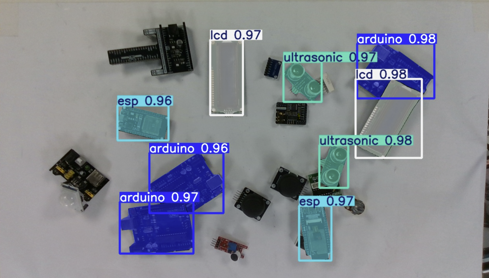
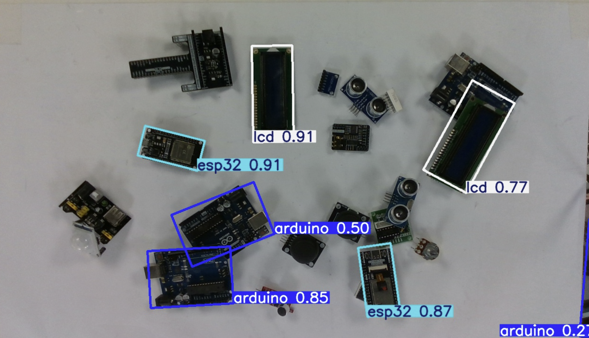
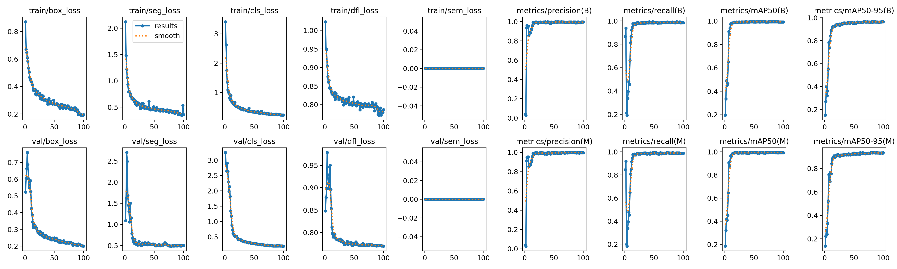

# Training the new YOLO-seg model and validating it

*[Previously,]() I pivoted from oriented boxes to instance segmentation and set out to annotate the 200+ image dataset. This entry is the dataset is labelled, the new model is trained, and it does what the legacy one couldn't.*

## The dataset split and samples

I'm following a **70/20/10 split** (train / validation / test) for the model. The images are all annotated; here are a few samples from the training set, across the difficulty range:







## Training the model

I trained a **YOLOv8-seg** model on **Google Colab** .I uploaded the dataset to Google Drive and used a **T4 GPU**, which is both faster and saves me from overworking my poor PC. It's a simple one liner, really:

```bash
!yolo segment train model=yolov8n-seg.pt data=/content/pickerbot.yolov8(1)/data.yaml epochs=100 imgsz=1280 device=0
```

## The results

Here's the per-class validation result straight from the notebook.precision, recall, and mAP for both the box and the mask:

| Class | Instances | Box P | Box R | Box mAP50 | Box mAP50-95 | Mask P | Mask R | Mask mAP50 | Mask mAP50-95 |
|---|---|---|---|---|---|---|---|---|---|
| **all** | 191 | 0.995 | 0.967 | 0.975 | 0.936 | 0.995 | 0.967 | 0.975 | 0.920 |
| arduino | 63 | 0.989 | 1.000 | 0.995 | 0.981 | 0.989 | 1.000 | 0.995 | 0.977 |
| esp | 41 | 0.991 | 0.976 | 0.986 | 0.956 | 0.991 | 0.976 | 0.986 | 0.958 |
| lcd | 46 | 0.998 | 0.935 | 0.942 | 0.904 | 0.998 | 0.935 | 0.942 | 0.901 |
| ultrasonic | 41 | 1.000 | 0.958 | 0.975 | 0.903 | 1.000 | 0.958 | 0.975 | 0.844 |

*(21 validation images, 191 instances. Speed: 23.1 ms preprocess, 21.9 ms inference, 5.6 ms postprocess per image.)*

Mask mAP50 sits around **0.97** across the board and mAP50-95 around **0.92**, with precision and recall near **1.0** strong numbers on every class, including the new **ultrasonic** class the legacy model never had.

## Eyeballing the predictions

Numbers are one thing; the real test is looking at predictions on held out images. Here's the new model:




And, for comparison, the **same image** run through the old model:



## The training curves

Finally, the training curves from `results.png` and they are trustworthy and excellent:



Every loss (box, seg, cls, dfl) falls smoothly and plateaus, and the **train and val curves track each other**. No divergence means no overfitting, which is reassuring given the small dataset. The metrics converge high and fast: both Box and Mask mAP50 ≈ 0.97, mAP50-95 ≈ 0.92–0.95, precision and recall ≈ 1.0, matching the validation table above. They also flatten by around **epoch 30–40**, so 100 epochs was more than enough . I could train fewer next time.

> The detector is strong and well-trained on my data distribution and, it separates overlapping instances the legacy model couldn't.

## Where this leaves me

The perception front end is now a segmentation model that masks each part cleanly, handles overlap and stacking, and covers all four classes.