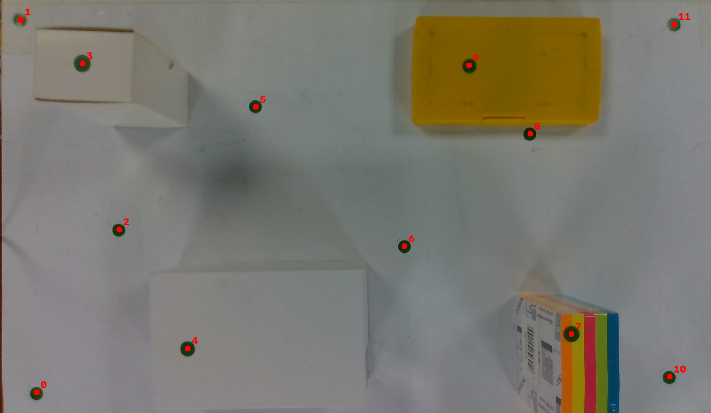
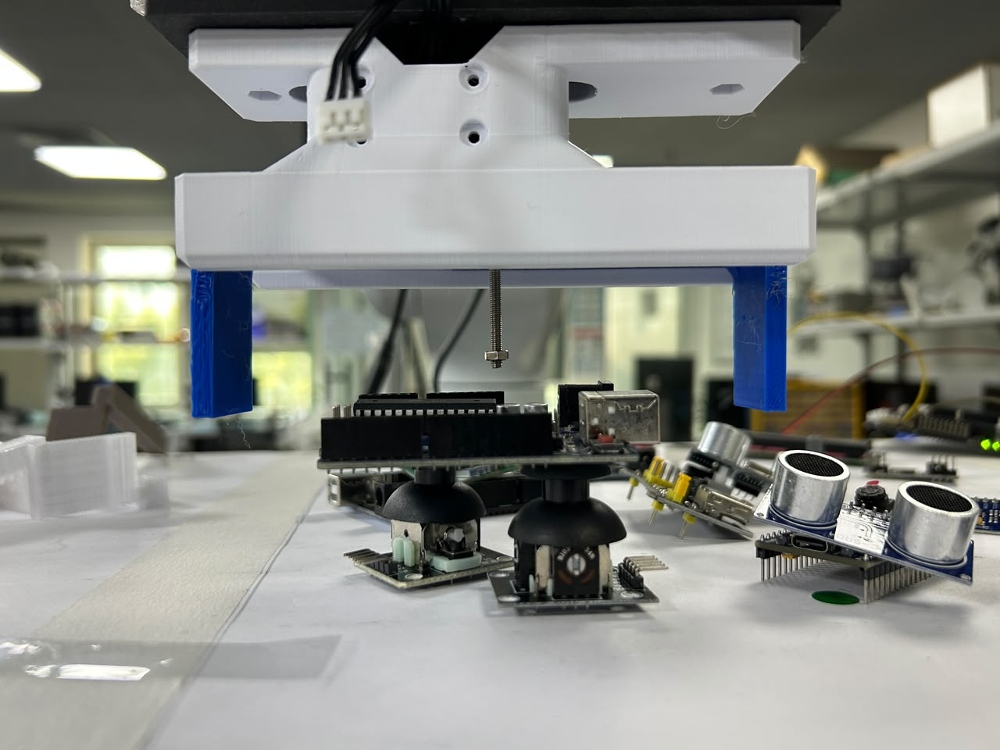
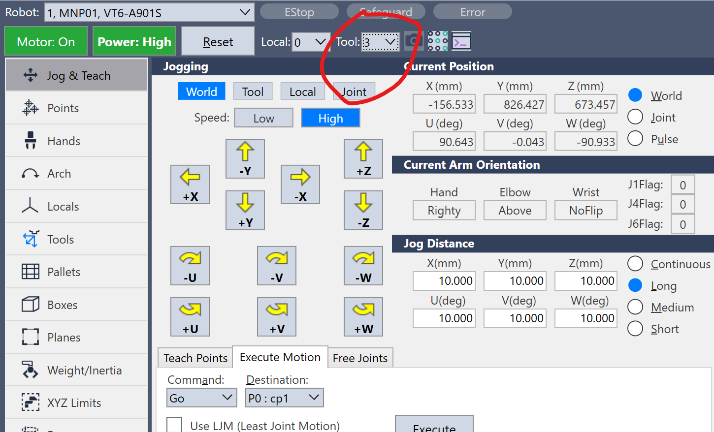
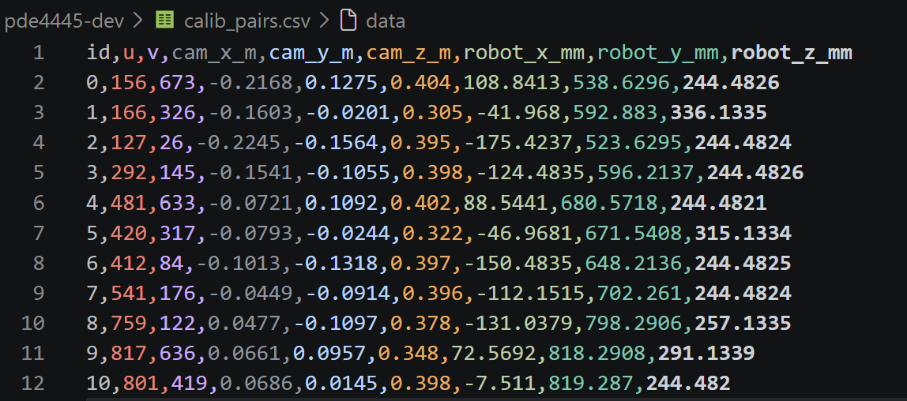

# Hand eye calibration

*[Previously,]() the segmentation model was trained and validated and the perception side knows *what* each part is and *where* it is in the camera frame. But the camera speaks in metres from the lens, and the robot speaks in millimetres from its base. This entry is about building the dictionary that is the hand-eye calibration.*

## What the calibration actually is

The method is **touch correspondence pairs**. The idea is simple

> For each marker, I get its position in **two frames** ,the **camera** frame (from the depth image) and the **robot** frame (by physically touching it with the tool tip) so I can solve for the transform between them.

Collect enough matched pairs and the solver can work out the single camera→robot transform that maps any future detection into a coordinate the arm can move to.

## Setting up the markers

For prep, I stuck **12 small high contrast markers** (a green sticker) across the table, spread out in X and Y and, importantly, I put a few of them on **small blocks of measured height** (2–3 different heights) so the calibration constrains **Z**, not just a flat plane. Clustered or coplanar points give a weak solve, spreading them in all three axes is what makes it robust.

## The camera side

I did all of the camera side captures first, in one go:

1. Go to the **capture pose**.
2. Run the helper from the repo root: `python pde4445-dev/calib_capture.py`.
3. In the live window, click each marker's centre **in order** (0, 1, 2, …). Each click logs that marker's camera-frame XYZ. Once all are clicked, press `q`.

That writes `calib_pairs.csv` with the **camera columns filled and the robot columns blank** the other half comes from the arm.

## The robot side

Then I touched each marker in the **same order**: for marker 0, jog the tool tip down until it *just* touches the marker's centre, read X/Y/Z from **Jog & Teach** (these are the tip coordinates), and type them into the `robot_x_mm / y / z` columns for id 0. Repeat for every marker, matching ids.

A note on **units**: the camera columns come out in metres and the robot columns in millimetres. the solver converts. When the CSV has both halves filled for every marker, that file *is* the whole calibration dataset.

## where calibration lives or dies

Calibration is unforgiving, so I was careful about a few things:

- **Touch the exact marker centre**, approach slowly, and use the **same physical tip point** every time the one Aman's **162.6 mm** TCP refers to.

- **Spread the markers and vary the height**
- **More points = more robust.** 
- **Don't nudge the camera** 

> **Make sure Tool 1 is active**, so the reading is the *tip*, not the *flange*. If Tool 0 (the flange) were active, every point would be offset by 162.6 mm and the solve would come out **wrong-but-plausible-looking**

The second: the tip is **genuinely contacting** the marker centre at the instant I read the numbers.

## The dataset is ready

With both halves filled in, the calibration CSV is done:

*`calib_pairs.csv` — both halves filled, one row per marker.*

## Where this leaves me

The calibration dataset is captured: 12 markers, each with a matched camera frame and robot frame position, spread across the workspace and across height. That's everything the solver needs.

**Next:** run the solver on `calib_pairs.csv` to compute the camera→robot transform and check the residual the target is **under 5 mm**.
