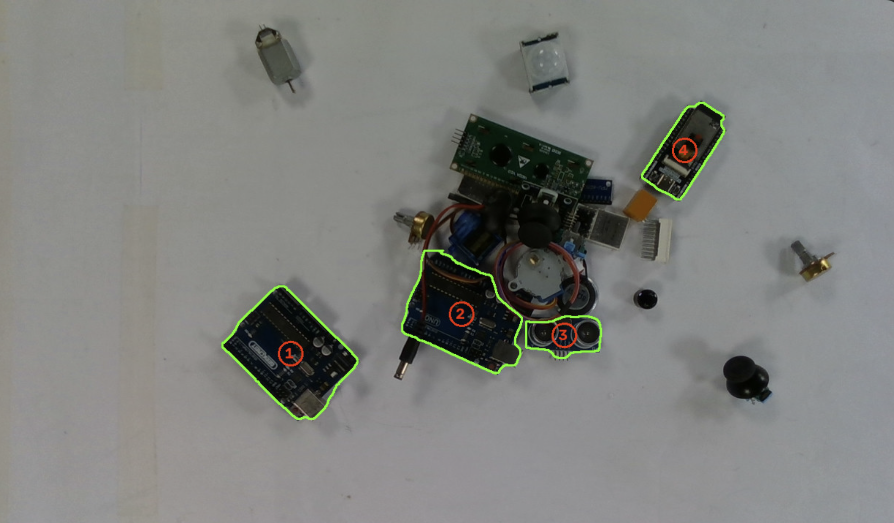

# The full pipeline, offline

*[Previously,]() the calibration solver gave me the camera→robot transform. That was the last missing piece so this entry is where everything from the last few weeks finally joins up into one chain, running end-to-end on a recording.*

## What I built

I put together a `detect_seg.py` plus a small **pose module** that, from a recorded `.db3`, does the whole job in one pass:

1. runs the **segmentation model** on the frame,
2. **fuses depth** inside each mask to get the part's 3D position,
3. applies **`handeye.json`** to convert that into robot coordinates,
4. and prints the **topmost-first pick list**.

## Validating the chain

Before trusting it on real frames I validated it on synthetic data using my real `handeye.json`, and the whole chain checks out:

- **The topmost-first sign is correct** — a nearer object gives a higher robot Z and is picked first, exactly as intended.
- **`part_pose` produces sane robot coordinates** — `z = 340 mm` matches my working height.
- The full sequence — **mask → 3D pose → robot mm → ranked order** — works end to end.

## What it outputs

The script prints the ordered pick list and saves two files:

- **`pick_list.json`** — `{label, x, y, z (mm), yaw}` per part, ordered highest first.
- **`pose_seg_out.png`** — the frame with masks drawn and the pick order numbered, so I can eyeball it.

## The dry run

Here's the pipeline running on a real recorded scene:

This is exactly the pipeline working: it picked out only the classes it should, ordered them top-down, and the labels and confidences are strong (**0.92–0.98**).

> A real milestone: camera → detection → 3D pose → robot pick coordinates → ranked order is now **done end to end**, and all of it runs **offline on recordings**.

## Where this leaves me

Pillar 1 is essentially complete in software: the system takes a frame, finds the parts, works out where each one is in the robot's own coordinates, and hands back a topmost-first pick list. And because it runs on `.db3` recordings, I can keep iterating without tying up the arm.

**Next:** take it live feed the pick list to the VT6 and close the loop from a real capture pose to a real pick.
