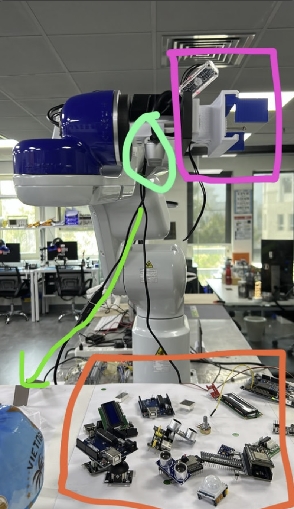
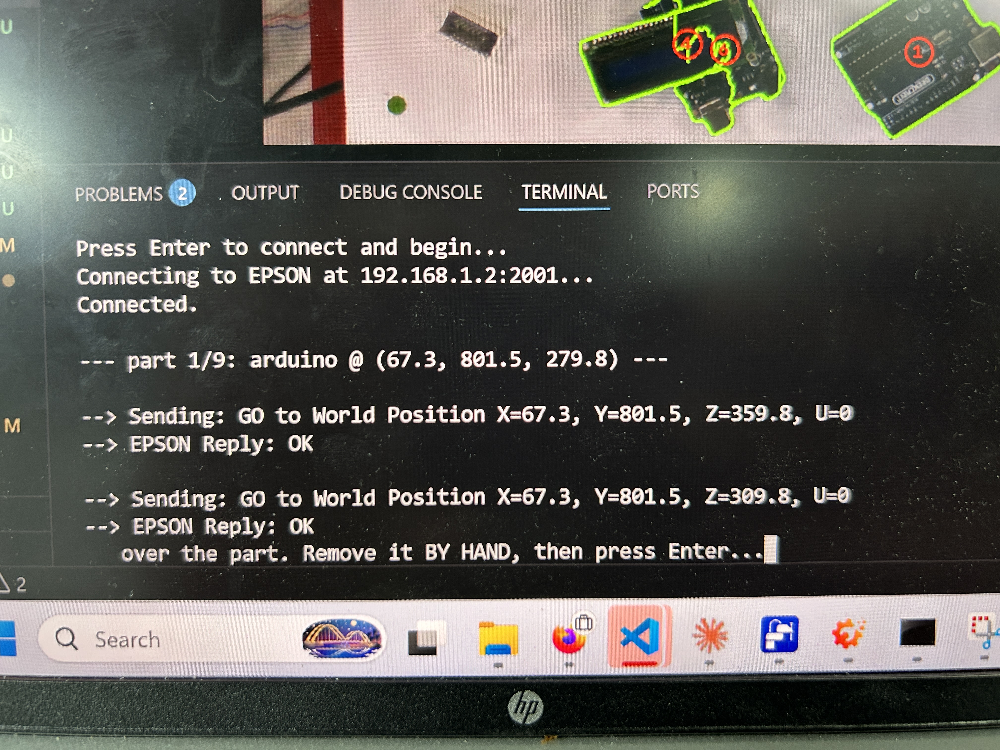
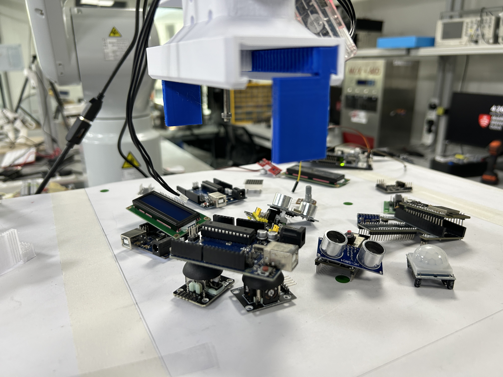
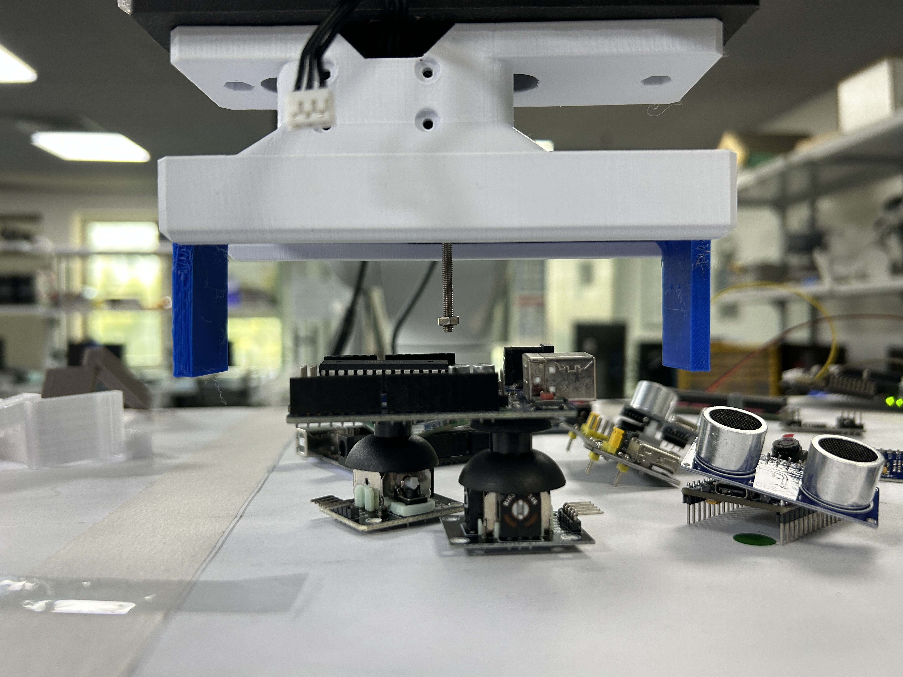

# Lab day: the first live vision-driven motion

*[Previously,]() I built the gripper API and rehearsed the whole pick offline, leaving a staged runbook for the bench. Today it met the VT6 and what I got was a long day of the unglamorous integration problems that never appear on a clean architecture diagram: serial drivers, IP subnets, wrist orientation. This entry is mostly a record of the failures, because that's where the engineering actually was today.*

I went in planning to work through yesterday's runbook chunk by chunk. Instead I spent the day fighting drivers and subnets and, at the end of it, got the most important result of the project so far: **my perception-to-robot chain driving the real VT6, live.**

Pre flight went fine until the gripper. Two things made me refuse to guess while solo. Aman's saved *closed* position was stored as an enormous number which turned out to be the raw form of a small **negative** tick: his servo runs in **extended position mode**, so "closed" is a few ticks past zero, but `travel_limits()` returns it unsigned (3103 open, 4294967155 = −141 wrapped). My `holding()` check, comparing raw values, would have read every grasp as a miss. The fix was a one line **sign correction** a small change with a large behavioural consequence, and a clean example of why a driver's numbers can't be treated as self describing without knowing its position convention.

Then the real hurdle: **my laptop has no USB-to-serial driver, so the U2D2 servo adapter isn't recognised at all.** Rather than a blocker, this became an architectural fork. The arm is *already* a network service over TCP, so the gripper becomes one too: Aman's laptop runs a small gripper server wired to the servo, and my orchestrator calls it over the LAN with **no change to the pick logic**, just a `GRIPPER_HOST` env var swapping an in-process import for a network call. The server came up ("serving on port 5005"), but even networked it wouldn't connect reliably, so I made a call: **prove my own contribution first.**

## The pragmatic pivot

My thesis contribution is the vision → pose → robot-coordinate → motion pipeline; the gripper is Aman's. So I defined a no-gripper test that exercises *my whole chain*: camera sees → pose → robot coordinates → full pick-and-place motion for every detected object, and after each "pick" I remove the part by hand so it isn't re-detected, with the place set to the capture pose for now. This isolates my work from Aman's unknowns completely.

## The EPSON connectivity saga

Reaching the controller ate most of the afternoon, and every step taught me something. First, an orientation subtlety: my SPEL+ receiver's `JUMP`/`GO` use `Here` and only override X, Y, Z, U so the wrist **V, W are inherited from wherever the arm currently is.** The arm has to *start* in the right orientation and the whole run rides on it. (This bites me twice below.)

The networking itself walked through a textbook error sequence: **refused** on `127.0.0.1` (nothing listening — the controller isn't local); realising `SetNet #201, "127.0.0.1"` names the *allowed client*, not the server's own address, so it must become `0.0.0.0`; finding the controller's real address (`192.168.1.2`, inside the VT6); the error then flipping to **timeout (10060)**, which is diagnostic refused means a host with no listener, timeout means *no route at all*. `ipconfig` explained it: my **Ethernet adapter read "Media disconnected."** RC+ talks to the controller over **USB**, but its TCP server lives on the **Ethernet LAN port**, and USB can't carry that socket. Cabling the LAN port and putting my PC on the controller's subnet (`192.168.1.10 / 255.255.255.0`) made `ping 192.168.1.2` reply.

The model I'm keeping: **I connect *to* the controller's IP; the receiver separately *allows* my PC's IP as a client two addresses, two jobs** and a working USB debug link says nothing about whether the socket has a path.

## Two receiver bugs

The first `JUMP` threw **error 4007 end/mid point out of the motion area**, from two causes in sequence. The `Jump3` **middle waypoint hardcoded `X(0)`**, routing the arch through an unreachable point; making it follow the target's own X fixed the arch. But 4007 persisted because **`Main.prg` runs `Home` on startup** so the arm left my capture pose and adopted Home's V, W, and the receiver (which only sets X, Y, Z, U) then tried to reach the capture *position* with the wrong wrist *orientation*: no valid joint solution. Commenting out `Home` and jogging to the capture pose myself fixed it.

> Because the receiver only sets X, Y, Z, U, the wrist's V, W are **inherited from wherever the arm starts** so the arm's *starting* orientation is a hidden precondition of every motion.

Then:

```text
--> Sending: JUMP to World Position X=-153.0267, Y=786.0599, Z=672.9122, U=90.6427
--> EPSON Reply: OK
```

My Python drove the real VT6, correct orientation, clean `OK`. After a day of subnet archaeology, seeing the arm obey a coordinate my code computed was the moment it felt real.

## The vision and the orientation

A fresh capture through `pose_seg` gave nine detections, all at Z ≈ 250–280 mm against a ~672 mm capture height, so every descent is into open space. The loop first died with a `FileNotFoundError`: my package **eagerly loaded the YOLO model on any import**, dragging the ML stack into an arm only script, and the weights had been renamed.

The arm reached the right XY but **dove in camera first**, driving the end effector at the table in the scanning orientation. This is a classic **eye-in-hand configuration with an offset tool**: camera and gripper are rigidly mounted on the J6 flange ~90° apart, and because the receiver inherits V, W, the pick kept the camera-down pose. 

Two clean resolutions: I confirmed **Tool 1 is already the gripper's working point** (it's the calibrated 162.6 mm flange-+Z, and the gripper mounts along that same axis), so the coordinates are correct as-is only orientation was wrong. And since `GO` preserves V, W, I made the loop `GO`-only and simply **started the arm gripper-down**, so it stays pointing down all run without touching the receiver.



*The orchestrator working through the pick list — part 1/9, an Arduino at (67.3, 801.5, 279.8), descending from Z=359.8 to Z=309.8 in two clean `GO`/`OK` exchanges.*



*The arm on its way down approaching on -Z toward the Arduino before the final descent.*



## Two known residuals

Both worth noting, both expected. The fingertips sit **~10–11 cm high** *not* a calibration error (XY lands dead on each centroid), but a **constant tool offset**: Tool 1 was calibrated to a hanging-string tip ~7–8 cm below the real fingertips, fixed by one `TOOL_Z_OFFSET_MM` constant. And the gripper **doesn't yaw** to grip across a part's short edge yet because `GO` can't set U (that's *why* the yaw holds), and the gripper-mount yaw offset is still unknown. The per-part angle already exists (`pose_seg` gives each part's long-axis yaw), so I need `U = yaw + YAW_OFFSET` via a `JUMP`, and I can calibrate `YAW_OFFSET` **by eye without powering the gripper** since it's physically mounted.

## Where this leaves me

The headline: **my full vision → pose → robot-coordinate → motion pipeline runs live on the VT6** topmost-first ordering, correct XY, clean gripper-down approach. After a day of IP addresses and wrist angles, that's a good place to stop.

**Next:** close out the bounded residuals — dial in the constant `TOOL_Z_OFFSET_MM`, calibrate `YAW_OFFSET` by eye, and bring Aman's gripper online. None are open research problems; they're tuning.
