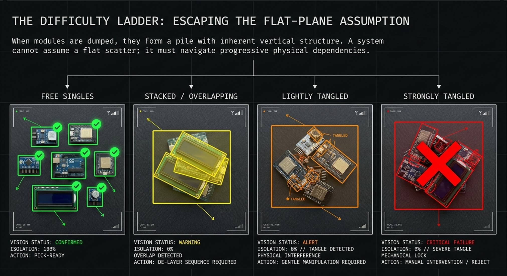

# Picker-Bot — Progress Blog

### Depth-Driven Pick Sequencing and Failure-Aware Verification for Bill-of-Quantities Retrieval of Microelectronic Modules from a Cluttered Workspace

**Faseeh Mohammed** (M01088120) · MSc Robotics, Middlesex University Dubai · Module **PDE4445**
Supervisors: **Dr. Sameer Kishore** · Companion thesis (end-effector & proprioceptive): **Aman Mishra**
Platform: **EPSON VT6-A901S** 6-axis arm · **Intel RealSense D435i** · **YOLOv8n-seg instance segmentation**
Code & work: **[GitHub repository](https://github.com/MrRox1337/picker-bot/tree/pde4445-pickerbot-faseeh/pde4445-dev)**

*This project has concluded*

---

  <iframe src="https://www.youtube.com/embed/RvMV7aG49nk" title="Picker-Bot — Full Demo" style="position:absolute;top:0;left:0;width:100%;height:100%;border:0;" allow="accelerometer; encrypted-media; gyroscope; picture-in-picture" allowfullscreen></iframe>

*[Watch on YouTube ↗](https://youtu.be/RvMV7aG49nk) — the full Picker-Bot demo: BOQ in, fulfilment report out.*

---

## The project in one glance

An electronics bench doesn't hold one part at a time it holds many kinds together: Arduinos, ESP32s, LCD panels, ultrasonic rangefinders, left resting on and against each other after use. Clearing the bench isn't actually the job; **retrieving the specific parts a schematic calls for** is. The project ended up reframed around that: a **bill of quantities (BOQ)** in, a **fulfilment report** out .

- **Depth-ordered, topmost-first sequencing.** These parts are near-uniform in thickness, so top-surface height is a free, depth-only proxy for what's accessible next one sort recovers it, instead of the occlusion reasoning heavier planners compute. Reported with the **null result** it returns: under continuous re-scanning, a depth-agnostic order clears just as well.
- **Two-signal, failure-aware verification.** A grasp is confirmed by the gripper's own proprioceptive check *and* a position-matched visual re-scan, because on real hardware they fail differently.

The operating envelope is declared: every part must be separable by a vertical lift alone — evenly spaced, neighbouring, overlapping, or stacked flat all qualify. Parts mechanically **interlocked** through their GPIO pins are excluded.

*The original difficulty spectrum this project started from. It's since been replaced by a precise boundary: separable by a vertical lift, or excluded.*

> **Aim.** Convert a planar, open-loop, order-agnostic predecessor into a depth-aware, class-conditional retrieval system that fulfils a BOQ inside that envelope, verifies every attempt, and reports its performance and failure modes as measured.

**Four research questions:**

- **RQ1 — Perception.** How reliably does segmentation + depth recover class, pose and height, and how does that degrade across scene density, lighting, and out-of-distribution objects? → **89.8% recall** over 45 recordings; 74% under clutter, 80% under low light.
- **RQ2 — Sequencing.** Does topmost-first improve retrieval over an order-agnostic baseline, and does that depend on re-planning? → Only once re-planning is switched off.
- **RQ3 — Verification.** Can two signals separate grasp failure from perception failure? → Yes — nothing evaded both signals in these trials.
- **RQ4 — The deficit.** What governs the gap between easy and hard scenes? → Perception, not the gripper: **93% fulfilment isolated vs. 57% crowded**, traced to mask contamination where parts touch.

---

## Start here (reading path)

1. [Initial brainstorming]() — the four features I started with.
2. [First supervisor meeting]() — the hard questions that reframed everything.
3. [Subject Area Review — Pt.1: Pick Sequencing]() — where "topmost-first" comes from.
4. [Subject Area Review — Pt.2: Entanglement]() — the hard boundary, and my object-class gap.
5. [Subject Area Review — Pt.3: Verification & Recovery]() — how "detect the tangle" actually works.
6. [Finalised — Problem, Question & Title]() — the locked framing, later reframed again around BOQ retrieval.

---

## Timeline

  

    
W1

W2

W3

W4

    
W5

W6

W7

W8

    
W9

W10

W11

W12

  

  <!-- Phase 1 -->
  

    

Phase 1 — Foundations &amp; framing

Weeks 1–2 · done

    

  

  

Literature review — three clusters

    

  

Problem statement, research question &amp; title

    

  

Blog live + subject-area-review posts

    

  

Hardware PO submitted (D435i arrived, not the D405)

    

  

Evaluation design (later superseded by isolated/crowded batteries)

    

  

Offline .db3 depth harness + code scaffold

    

  

  <!-- Phase 2 -->
  

    

Phase 2 — Perception &amp; calibration

Weeks 3–6 · done — twice as long as planned

    

  

  

Sensor bring-up — D435i arrives, first frames (17–19 Jul)

    

  

Depth segmentation discovery — the pile-in-one-box finding

    

  

Camera mount + capture pose, tilt to 0.2°

    

  

Unplanned pivot: oriented boxes → instance segmentation

    

  

Hand–eye calibration — RMS 2.67 mm (target was &lt;5 mm)

    

  

  <!-- Phase 3 -->
  

    

Phase 3 — Mechanisms

Weeks 7–10 · done — shifted two weeks later

    

  

  

Full pipeline dry run + gripper API (13–14 Aug)

    

  

First live vision-driven motion on the VT6 (15 Aug)

    

  

First human-in-the-loop gripper pick (2 Sep)

    

  

Clutter clearing, Arduino-only (5 Sep)

    

  

  <!-- Phase 4 -->
  

    

Phase 4 — Experiments &amp; analysis

Weeks 11–12 · done — compressed from four weeks to two

    

  

  

Current-range fix — every class finally grips (8–12 Sep)

    

  

Re-scan ablation — the null result (12 Sep)

    

  

BOQ retrieval + blocker_cleared (15–19 Sep)

    

  

Gated PnP battery — 93% isolated vs. 57% crowded (19 Sep)

    

  

  <!-- Phase 5 -->
  

    

Phase 5 — Writing &amp; delivery

Week 12 → 25 Sep · done

    

  

  

Draft ~8-page IEEE-format research article

    

  

Report submitted (25 Sep)

    

---

## Deliverables & assessment

| Deliverable | Weight | Due | Status |
|---|---|---|---|
| Project blog (this site) | **40%** | 26 Jul 2026 | ✓ Done |
| Project report — ~8-page research article | **40%** | 25 Sep 2026 | ✓ Done |
| Final presentation — supervisor + second marker | **20%** | 30 Sep 2026 | ✓ Done |
