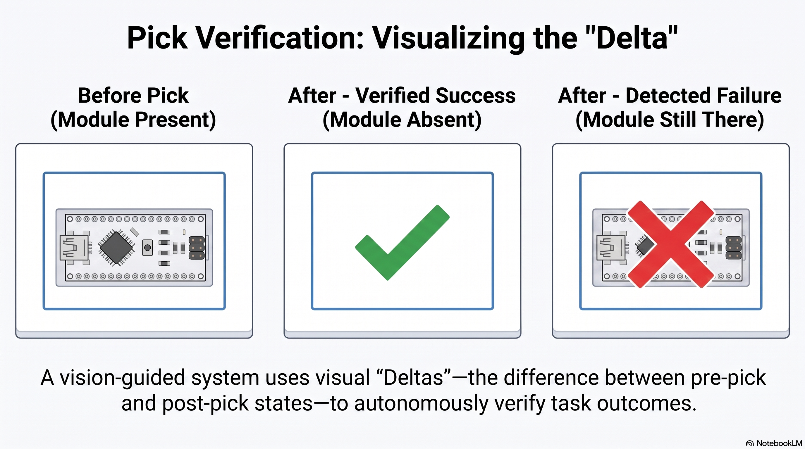

# 01/07/2026 — Subject Area Review, Part 3: Verification & Recovery

*[Part 2]() ended on a promise, my system **detects** a tangle rather than solving it. But detecting is only half of it ,the system has to *do* something when a pick goes wrong. This last part of the review is about that machinery: **grasp verification and failure recovery** How a robot knows a pick failed, and what it does next.*

## Why this cluster closes Pillar 2

For me, "detect the tangle" (Part 2) and "verify the pick" are the *same act*: after a pick attempt, look again and ask *did that work?* So this cluster is the machinery behind Pillar 2.

It's also where my project's unusual structure shows up. Picker-Bot is **two theses sharing one arm**: I own the **exteroceptive (vision)** side; Aman owns the **gripper's proprioceptive** signal. So I read this literature with one question in mind: *how do vision and gripper feedback combine to catch a failure?*

## What the three papers do

They line up neatly along the spectrum of failure handling. **prevent → detect → recover**.

**Zhu et al. (2021), "Failure Handling… With Multimodal Cues Under Partial Object Occlusion" (Frontiers in Neurorobotics).** The anchor. They treat pick-and-place as a chain, grasp planning → establishment → lifting → placing and catch failures across it by **fusing multimodal cues**: vision (robust pose estimation and object tracking, even under partial occlusion) *and* gripper/contact feedback. This is exactly the pattern my two-thesis architecture needs= vision + proprioception, fused, which is why it's my anchor rather than just a citation.

**Ahmad et al. (2025), "A Unified Framework for Real-Time Failure Handling" (arXiv:2503.15202).** A general recovery framework combining **Vision-Language Models, a reactive planner, and Behavior Trees**, with a scene graph and execution history for context. It does **pre-execution verification** (catch failures *before* acting) and **reactive handling** (detect and correct *during* execution — even generating new skills). Powerful and general and heavy: VLM reasoning, BT machinery, structured scene state.

**Ko et al. (2025), "Simultaneous Pick and Place Detection… SE(3) Diffusion + Differential Kinematics" (arXiv:2504.19502).** Prevents a whole class of failures at *detection* time: a grasp **diffusion model constrained by differential inverse kinematics** so every candidate grasp is guaranteed **reachable and placeable** for *both* pick and place. Feasibility aware grasping i.e don't commit to a pick you can't complete.

## The common thread

Failure handling spans **prevent** (feasibility aware, Ko) → **detect** (during/after execution, Zhu) → **recover** (re-plan or re-skill, Ahmad). Two things stand out. First, the field is trending **closed-loop, multimodal, and heavyweight**, VLMs, behaviour trees, diffusion models. Second, the one constant that matters to me is Zhu's result: **fusing vision with gripper feedback is the effective pattern** for catching pick failures.

*My verification loop: a single post pick rescan decides success, failed grasp, or tangle then either logs-and-skips or nudges and retries.

## What this means for my project (Pillar 2)

This cluster sets the ceiling I'm deliberately staying under, and it validates my architecture:

- **Verification is the minimal viable version.** Where the field reaches for VLMs, behaviour trees, and diffusion models, mine is a post pick **re-scan of the ROI**: object gone ⇒ success; still there ⇒ failed grasp; neighbours moved ⇒ tangle. Cheap, training-free, exteroceptive. Consistent with the whole thesis: *sufficient and cheap, not state-of-the-art.*
- **The two-thesis interface is exactly Zhu's pattern, split in two.** I own the vision modality; Aman owns the gripper's proprioceptive boolean; we fuse across a defined interface. Zhu (2021) is my justification that this multimodal fusion is the right thing to do.
- **Recovery is a stretch, and stays small.** The field re-plans or generates new skills (Ahmad); mine is a single open-loop disturbance nudge + retry, only for *lightly* tangled parts. Ahmad and Ko define the expensive end I'm not reaching for.
- **Feasibility, done cheaply.** Ko checks reachability and placement at detection time; my approach check with skip-if-blocked is the poor-man's version. Don't attempt a pick I can't clear.

*The check, illustrated: compare the region before the pick (module present) with after module gone ⇒ verified success; module still there ⇒ detected failure.

So Pillar 2's verification claim is, once again, narrow and honest: **a cheap, training-free re-scan that confirms a clean single-object pick, flags failures and tangles, and fuses with a companion proprioceptive signal enough to make pile-clearing robust, without a heavyweight recovery engine.**

## That's the review done

Three clusters, three roles: **sequencing** (Pillar 1 — [Part 1]()), **entanglement** (Pillar 2's hard boundary — [Part 2]()), and **verification & recovery** (Pillar 2's machinery — this part).

**Next:** consolidate all three into a sharpened problem statement, a single research question, and a title.

### References
- Zhu, Wang, Wen, Yang, Pan, Wang & Wang (2021). *Failure Handling of Robotic Pick and Place Tasks With Multimodal Cues Under Partial Object Occlusion.* Frontiers in Neurorobotics 15:570507. doi:10.3389/fnbot.2021.570507
- Ahmad, Ismail, Styrud, Stenmark & Krueger (2025). *A Unified Framework for Real-Time Failure Handling in Robotics Using Vision-Language Models, Reactive Planner and Behavior Trees.* [arXiv:2503.15202](https://arxiv.org/abs/2503.15202)
- Ko, Ikeda, Opra & Nishiwaki (2025). *Simultaneous Pick and Place Detection by Combining SE(3) Diffusion Models with Differential Kinematics.* [arXiv:2504.19502](https://arxiv.org/abs/2504.19502)
