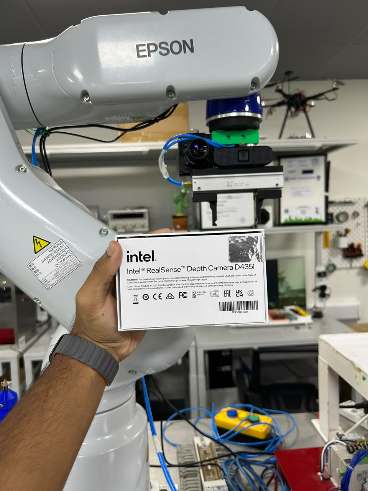
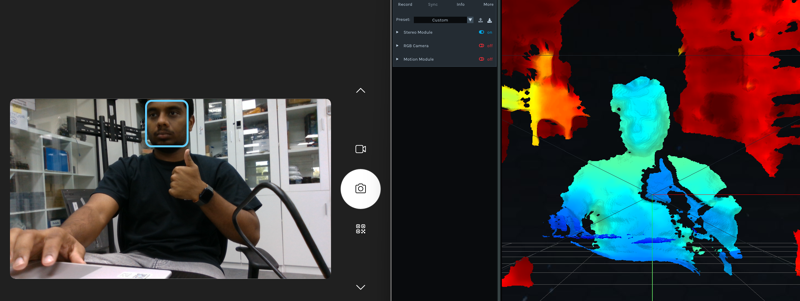
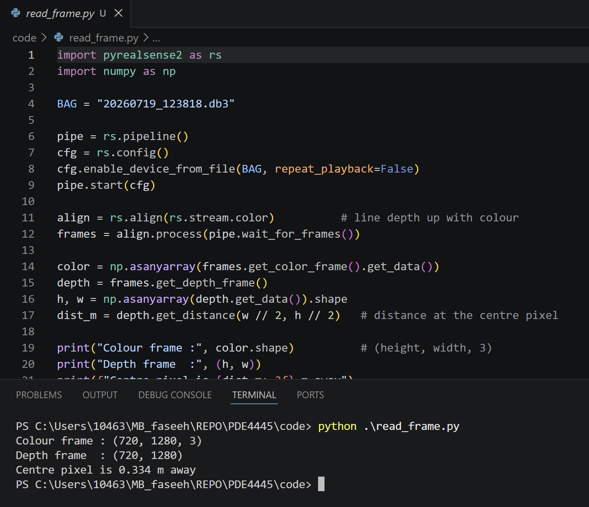
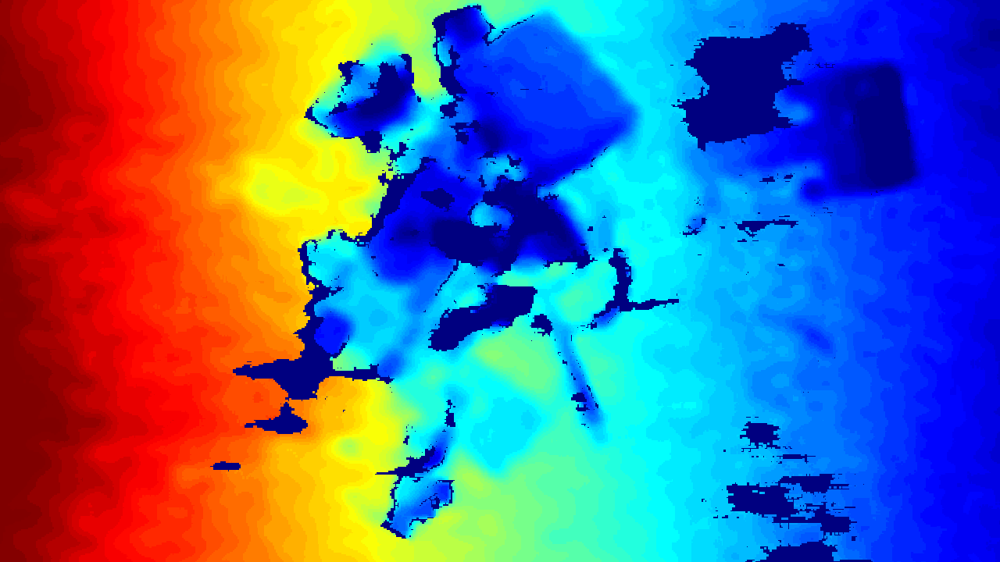
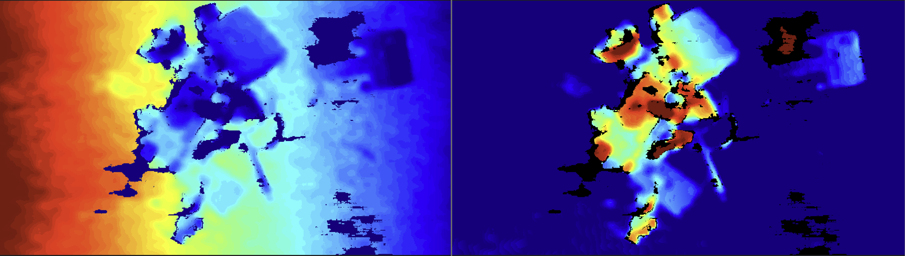

# The D435i arrives: first frames, and a tilt that taught me something

*[Finalising the project](): out of the library and onto the bench. This week the hardware showed up, so this entry is sensor bring-up, my first recording, and one honest surprise in the depth image that turned out to be the whole reason the pipeline is built the way it is.*

## First contact with the camera

The RealSense **D435i** arrived and I headed straight to the lab. I've never used a depth camera personally before, so before writing anything serious I wanted to tinker with it and build some intuition for what it actually gives me.

I installed the SDK and spent a while just messing around with the live viewer pointing it at things, watching the depth stream update in real time. Seeing myself rendered in depth for the first time is genuinely one of those small "oh, *cool*" moments that makes the abstract feel real.

## D405 vs D435i 

I'd originally specced the **D405** for its short-range accuracy, but MDX procurement sourced the **D435i** instead. no drama. My project buddy **Aman** suggested we build a **flip/flag in a config file** so the code auto-adjusts between depth cameras: if we do get hold of a D405 later, we switch a single setting rather than rewriting the pipeline. That keeps me unblocked now and future proofs the swap. Kudos to Aman for the idea.

## The first recording

I recorded a short `.bag` of the workspace to see what information I'd actually get back, then wrote a small script (`read_frame.py`) to pull a single frame out of it and save both the **colour** and the **depth** view.

## The rainbow that shouldn't be there

Here's where it got interesting. Even though I'd aimed the camera **parallel to the workspace** by hand, so not remotely precise, but I tried ,the depth image still showed a clear colour gradient sliding across a surface I *know* is flat: red (near) → yellow → green → blue (far).

That gradient is the **tilt**. A depth camera measures distance along its own line of sight, so if it's even slightly off-square to the table which it will be, held by hand, a flat table becomes a **ramp of distances**: one edge is genuinely closer to the lens than the other. Hence the rainbow across something I know is flat. The parts, meanwhile, show up as slightly darker blue because they stand up a little, so locally they're a touch nearer than the table right around them.

## Why that gradient matters

This is the bit that reframed how I think about the whole pipeline:

> **Raw depth is distance-*from-camera*, not height-*above-the-table*.** And the tilt gradient here is bigger than my parts are tall. So a part sitting on the far (blue) side of the table can read as "farther" than the bare near (red) edge. A naïve "nearest pixel = topmost" rule would be fooled by the tilt before it ever saw a real pile.

That's exactly why the pipeline has to **fit the table surface and subtract it**, so every point is measured as *height above the table* rather than raw distance from a wonky camera. I'd scoped that step out on paper; seeing the tilt with my own eyes is what made it click that it isn't optional.

hand-held is perfectly fine for these test recordings. The real rig will be a fixed, roughly level mount and the plane-fit cleans up whatever residual tilt remains anyway, so I'm never depending on holding the camera perfectly square.

## Fit, subtract, recolour

So the natural next step is to fit the table plane, subtract it, and re-colour by **true height**. In theory the tilt gradient should vanish, the table should go flat and uniform, and the parts should light up purely by how tall they stand which is the topmost-first signal, made visible.

I implemented that, and the difference is far easier to read and understand.

Two things in the "after" image are **normal, not errors**: a bit of speckle at object edges (depth is always noisy at boundaries), and the table not being perfectly uniform.

## Where this leaves me

First frames captured, the tilt understood, and a height map that measures how high each part sits above the table.

**Next:** use that height map to find the parts and rank them tallest-first and find out where naive height-based segmentation starts to break.
