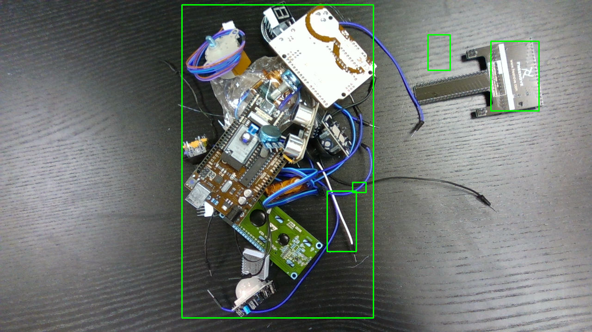

# Why naive depth segmentation merges a pile, and why I need YOLO + depth fusion

*[Previously,]() I got a clean height map every point measured as height above the table rather than distance from a hand-held lens. Now use that height map to find my parts and put them into a pick order. The plan is to find the parts, then rank them tallest first.*

## Finding the parts by height

The first attempt is to threshold the height map (anything standing above the table is "part"), then draw a box around each connected blob.

*The result of pure height-blobbing, one clean box on the free single, one giant box swallowing the whole pile.*

Here's what that image tells me:

- **The isolated board on the right got its own correct box.** For a free single, height-blobbing already works.
- **The whole pile in the middle collapsed into one giant box.** That's the core problem. A height threshold only knows "this pixel is above the table"; when parts touch or overlap, their pixels connect, so they merge into one blob. **You cannot separate a pile by height alone.** That's exactly why naive depth segmentation isn't enough and why the project needs a detector.
- **The stray boxes** (the thin one over a jumper wire, the small ones) are partly table glare giving false depth on that glossy surface tunable with a higher threshold and partly the specular noise I'd already scoped out.

## The key realisation

This is the heart of my two-part design:

> **YOLO separates the parts; the height map ranks them.** Depth doesn't need to carve up the pile, instead, YOLO-OBB draws a box around each individual part (even in a pile, because it has learned what an "Arduino" or "ESP32" *looks like*), and then I read the height map inside each YOLO box to get that part's height, and sort those → topmost-first.

Height is the **ordering** signal; YOLO is the **separation**. Neither alone is enough.

## Where this leaves me

I now have direct, visual proof of exactly where depth-only segmentation breaks and a clear reason for the fusion design rather than a hunch. The pile that collapsed into one box is the whole argument for a detector.

**Next:** bring YOLO into the picture get the OBB detector separating the parts so the height map can rank them.
