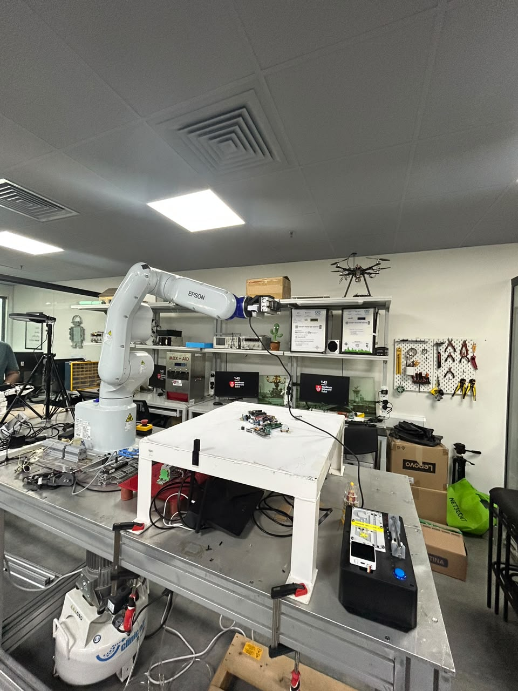

# Mounting the camera, an eye-in-hand that acts eye-to-hand

*[Previously,]() the pile-in-one-box result made the case for a detector. But before I bring YOLO in, I want the camera fixed in a proper top-down view of the workspace, so every capture is consistent. This entry is about how I got there and a mounting trick that keeps things simple without stealing space from the arm.*

## The problem with a fixed overhead mount

The clean solution would be a fixed eye-to-hand camera looking straight down at the workspace. But when I looked around the lab, there was no good way to build one: rigging a tripod from the ceiling, or a long extension out over the workspace, would mean real work on the lab infrastructure and worse, it would sit in the way of the VT6 workspace.

## The idea: mount the camera on the arm

So why not mount the camera on the robot itself? Technically that makes it **eye-in-hand**, but I can make it *act* eye-to-hand: put the camera on a **different side of the arm, away from the end-effector**, so Aman's end-effector still has enough room on the VT6.

## Why this works

Here's the clever part and why it makes life easy:

> Because I always shoot from **one fixed "capture pose,"** the camera is in the exact same place relative to the robot base every single time it takes a photo. An industrial arm like the VT6 returns to a taught pose extremely repeatably hundredths of a millimetre. So even though the camera *can* move, at the moment of capture it's effectively a **fixed overhead camera**.

That means I calibrate the camera→robot "dictionary" **once**, for that capture pose, and reuse it forever. I get the simplicity of a fixed camera without giving up the space or modifying any structure in the lab.

## The consequence

Since the camera rides the arm now, the moment the arm leaves the capture pose to go pick something, it can no longer see the table. So I work from a **single snapshot**: go to capture pose → photograph → detect and plan the whole pick sequence → execute. That's totally fine for my "detect once, then clear the pile" design.

The only place it bites is **verification**: to re-scan after a pick and check *did it work / is it tangled*, the arm has to return to the capture pose and take another photo. So each verification costs one **return-trip**.

## Calibration with a twist

Calibration still works exactly the same way with one wrinkle because the tip and the camera share one arm. I put a few small markers on the table; from the capture pose the camera records where it sees each marker; then I jog the tip over to touch each of those same markers and record the robot's position. The markers don't move, so I still get matched **(camera-point, robot-point)** pairs.

## Things to check while I design the mount

- **Occlusion.** At the capture pose, I need to make sure the gripper / Aman's end-effector isn't hanging in front of the downward view. Putting the camera on the side helps, but I have to check the geometry so the arm isn't photographing its own hand.
- **Height.** The capture pose needs to be high enough to see the whole workspace, but the D435 gets noisier on small parts the farther it is so I want the *lowest* height that still frames the table. I have the freedom to tune this, since it's just a taught pose.

## Where this leaves me

A mount that gives me a consistent, repeatable top-down capture without rebuilding the lab or crowding the gripper and a calibration and verification workflow.

**Next:** get the mount built and the capture pose taught.
