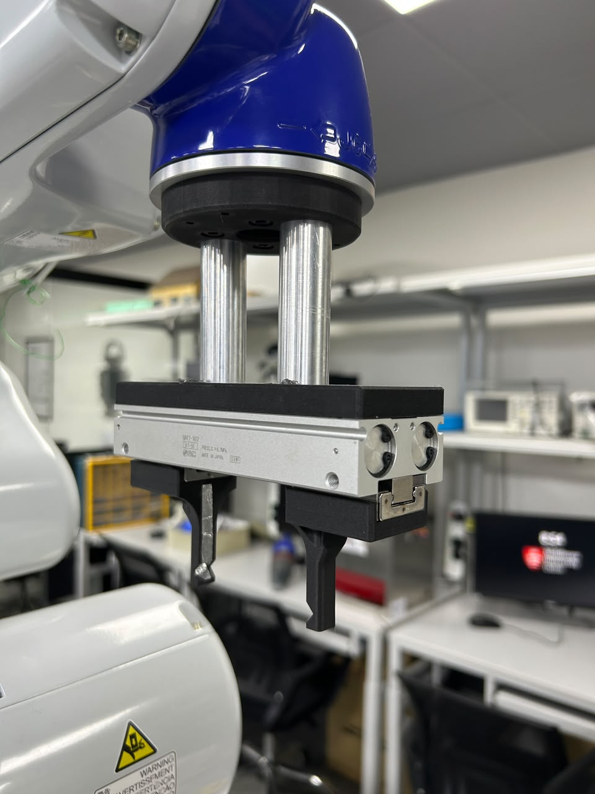
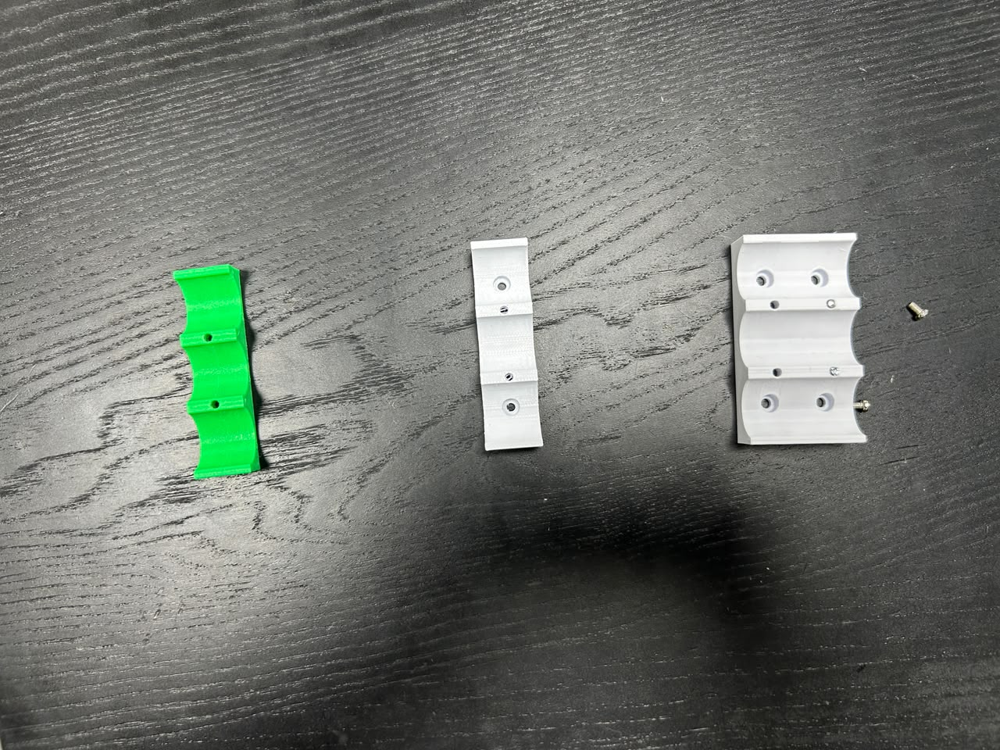
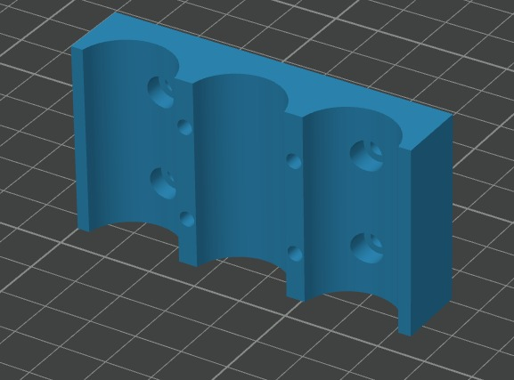
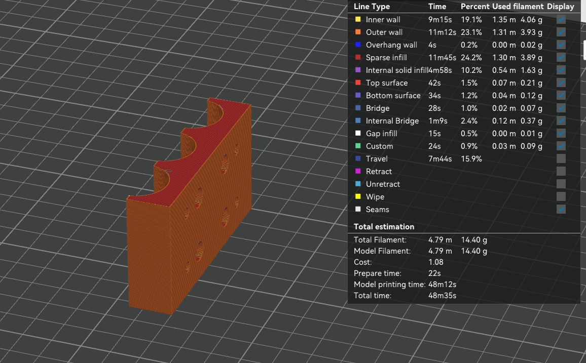
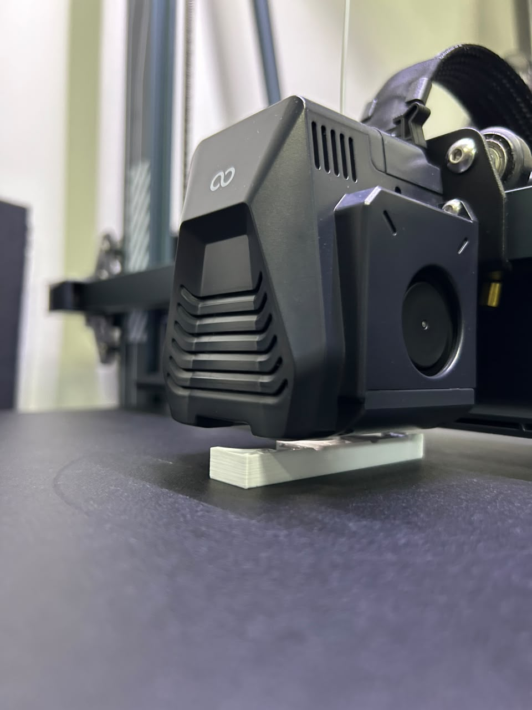
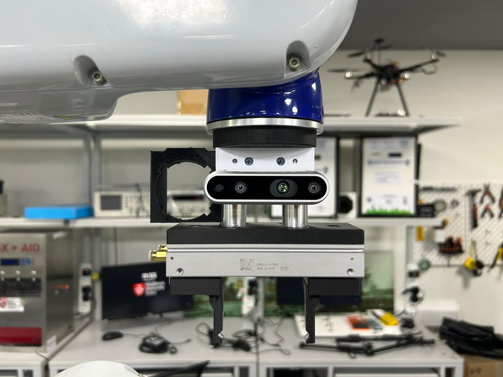
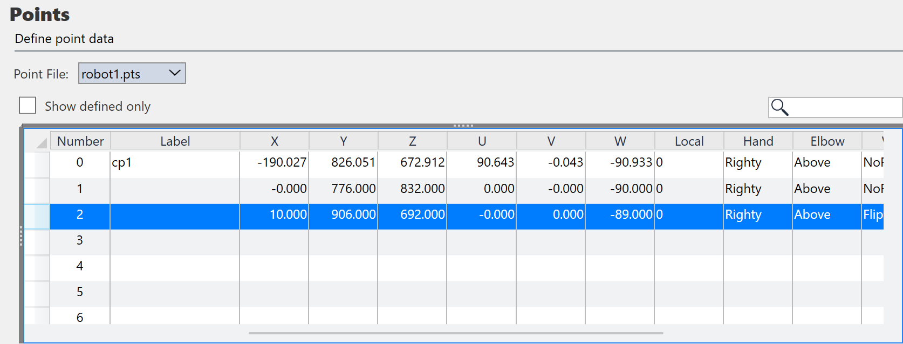
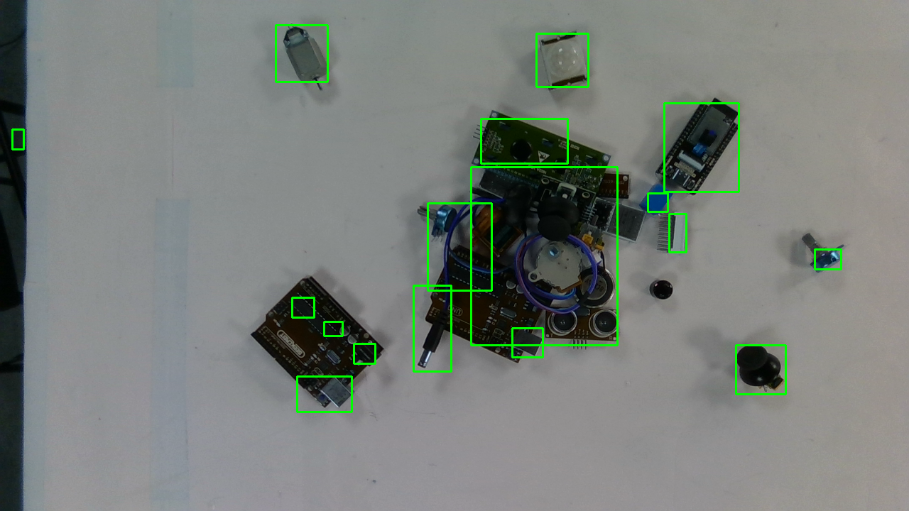

# The mount goes in

*[Previously,]() I settled on mounting the camera on the arm and shooting from one fixed capture pose. This entry is where that plan becomes hardware: a 3D-printed mount, a taught capture point, and the whole pipeline run end-to-end.*

## Reusing what's already on the arm

I headed to the lab to work out a mount for the depth cam on the robot. Inspecting the VT6, I found there's already a **custom 3D-printed clamp** on it from a previous project, holding a webcam. So with Aman's suggestion we decided to reuse the same mount design and just **change the dimensions** to fit the RealSense.

*The plan: mount it on the two columns right after the flange and before the end-effector.*

## Mount iterations

The mount went through a few versions before it was right. The first existing mount is on the left below (the green one). The middle was our first print for the RealSense, but it didn't let us screw the mount in place from *both* sides so we settled on the latest model (rightmost).

*Left to right: the original green webcam clamp, the first RealSense print (couldn't be screwed from both sides), and the final model.*

Aman designed the CAD, and we got to 3D printing it.

*The CAD for the final mount.*

*Prepping the print in the slicer.*

*The print in progress.*

And lo and behold ,the mount for the RealSense, now affixed to the robot.

*The RealSense on its new mount, fixed to the arm.*

## Teaching the capture pose

Next I had to teach the VT6 the new points. I kept the camera **41 cm from the workbench**. I reckoned that was a sweet spot given the D435i's field of view (**H 87° × V 58°**) and operating range (**~0.3–3 m**): high enough to frame the whole workspace, low enough to keep the small parts crisp.

The VT6 point was taught and saved as a teach point; the coordinates are below.

## Two findings

I compiled all the earlier scripts into one (`pipeline.py`) and ran it from the fixed pose.

**Finding 1 — the mount is doing its job.** The table tilt came out at **0.2°**. I went from **7° hand-held to 0.2° fixed** essentially dead level and, the important part, it'll be that *same* value every time now. So later I can literally **bake this plane in as a constant** instead of re-fitting it on every capture.

**Finding 2 — a new lesson about the detection.** My segmentation finds things that stick up (>5 mm above the table). Look at what that did to the Arduino: the board itself is flat the PCB is only a millimetre or two thick, below the threshold so it vanishes, and only its **tall bits** (the USB socket, barrel jack, header pins, the electrolytic caps) poke above 5 mm, and each gets its own box. The board **fragments into its own connectors**. The small capacitor was just too short to clear the bar.

> **Height-thresholding detects protrusions, not objects.** if i drop the threshold to catch the flat board then I'll start merging it with neighbours and picking up paper texture instead.

YOLO fixes both, because it recognises "that's an Arduino" as a whole object regardless of how tall it is and then my height map ranks whatever YOLO found. **Depth for ranking, YOLO for identity.**

*(Side note: switching to a white paper background helped a lot much less glare than the dark bench.)*

## Where this leaves me

The camera is mounted, the capture pose is taught and repeatable, the tilt is down to 0.2° and effectively constant, and the whole pipeline runs end-to-end from one snapshot.

**Next:** the YOLO and Calibration.
