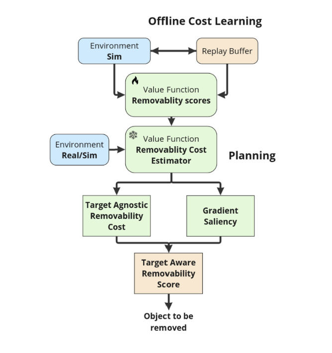
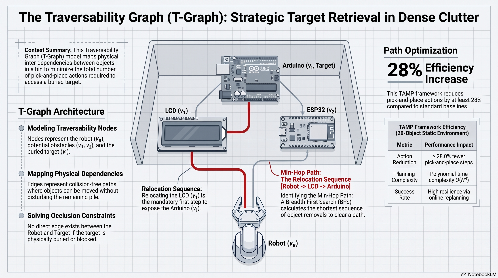
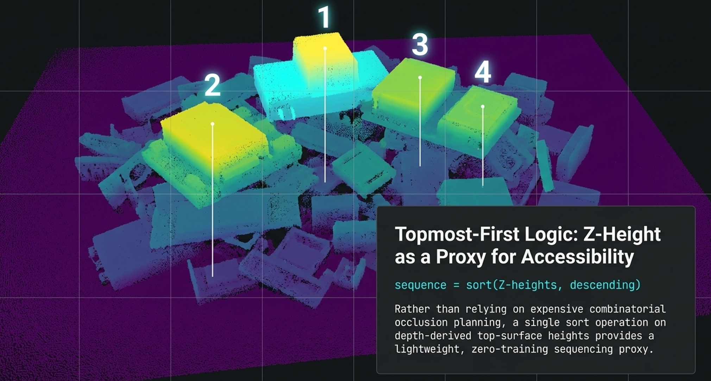

# Part 1: Pick Sequencing & Clutter Removal

*Straight out of the [meeting with Dr. Sameer]() and into the literature. His challenge was blunt: "where does tallest-first come from — and does it feel right?" So I started with the cluster closest to my central claim: when a robot faces a pile, **which object should it pick first?***

## Why I started here

My whole project leans on **pick ordering**. Before I'm allowed to defend "pick the tallest/topmost first," I need to know how the field actually decides pick order and, honestly, whether anyone just picks the tallest. I pulled four papers that between them span the range from classical planning to the very latest learned methods.

## What the four papers actually do

I read these looking for one thing: *how does each one choose what to pick next, and what does that cost?*

**Nam et al. (2020), "Fast and resilient manipulation planning for target retrieval in clutter" (ICRA).** A task-and-motion planning (TAMP) framework that retrieves a target buried in dense clutter by relocating the objects blocking it, while **minimising the number of pick-and-place actions** (at least 28% fewer than baselines on a 20-object scene). The pick order here is the output of a combinatorial plan. Powerful but it assumes a known configuration, leans on motion planning, and is aimed at reaching *one* target, not cheaply clearing a whole pile.

**ClutterNav (2025), "Gradient-Guided Search for Efficient 3D Clutter Removal with Learned Costmaps."** This one is telling. They explicitly argue that **rule-based heuristics are too rigid and computationally heavy**, and that end-to-end reinforcement learning is uninterpretable so they train a **"removability critic"** from demonstrations that scores the cost of removing each object, plus integrated gradients that estimate how each neighbour affects the target's accessibility. The result is described as "near human-like strategic sequencing without predefined heuristics." Impressive but it needs demonstrations and training, and the *signal it learns* is accessibility/occlusion.

*The kind of "expensive machinery" I'm contrasting against — ClutterNav's learned removability pipeline (after Ravie et al., 2025): an offline-trained value function plus gradient saliency, just to decide what to remove next.*

**Zeng et al. (2018), "Robotic Pick-and-Place of Novel Objects in Clutter" (MIT–Princeton, 1st place, Amazon Robotics Challenge 2017).** A category-agnostic **affordance** predictor picks among four grasp primitives and effectively grasps whatever is *most graspable* next, with cross-domain image matching to recognise novel objects. A landmark clutter system but the ordering is implicit inside a large learned affordance model plus multi-primitive hardware.

**Yu et al. (2025), "Towards Reliable Sequential Object Picking in Clutter" (Runner-up, RGMC 2025).** The closest to my task: a sequential-picking pipeline built on explicit **representations of object distribution and occlusion relationships**, feeding a rearrangement policy and a multi-modal gripper (soft + electromagnet + suction). Again, the ordering is driven by *modelled occlusion* and it takes serious hardware and representation to get there.

## The common thread (this is the important bit)

Every single one of these systems decides *what to pick next* — so **ordering clearly matters; nobody in the field disputes that.** But not one of them just "picks the tallest." They compute accessibility, occlusion, or removability with expensive machinery: combinatorial planning, a learned critic, an affordance network, an occlusion graph. Strip the machinery away and the signal underneath is the same in all four: **take the most accessible / least-occluded / on-top object first.**

That reframes my hypothesis so it finally *feels right*: it was never that "tallest is special." In a dumped pile, **height is a cheap, depth-only proxy for on-top-ness / low occlusion** the exact quantity these papers spend so much to estimate. Everyone's intuition agrees you clear a pile top-down.

## The T-Graph is my 'North Star' and I'm taking a shortcut

Of the four, **Nam et al.** is the one I keep coming back to. They model clutter as a **traversability graph**: objects are nodes, collision-free moves are edges, and a search finds the **min-hop path** the shortest sequence of relocations needed to expose a buried target. It's elegant, and it's the ideal I'm measuring myself against.

*My adaptation of the traversability-graph idea to my three modules. Powerful — but building it means reasoning over pairwise object dependencies and needing geometric models of the scene, so planning cost climbs steeply with object count (the polynomial-time complexity flagged top-right).*

But I don't need to *build* that graph. In a dumped pile, an object is traversable when nothing sits on top of it and **the object with the highest top-surface Z is, by definition, the least occluded and most traversable.** So a single `sort()` on depth-derived heights recovers the same "what next?" logic the T-Graph computes combinatorially with zero prior modelling and negligible compute.

*My cheap proxy: pick order taken straight from `sort(Z-heights, descending)` on the depth map. Highest = most on-top = picked first.*

## Where this leaves me

The literature did exactly what Dr. Sameer asked: it moved "tallest-first" from an assertion to a **positioned, defensible claim** ,a cheap proxy for a signal the whole field agrees on, to be proven against a baseline.

**Next (Part 2):** the cluster that makes my object set unusual,**entanglement** (a pile of pin-headed modules interlocks in a way a bin of boxes never does), and then **grasp verification / failure detection**.

### References
- Nam, Lee, Cheong, Cho & Kim (2020). *Fast and resilient manipulation planning for target retrieval in clutter.* ICRA. [arXiv:2003.11420](https://arxiv.org/abs/2003.11420)
- Ravie, Vasan & Sebastian (2025). *ClutterNav: Gradient-Guided Search for Efficient 3D Clutter Removal with Learned Costmaps.* [arXiv:2511.12479](https://arxiv.org/abs/2511.12479)
- Zeng et al. (2018). *Robotic Pick-and-Place of Novel Objects in Clutter with Multi-Affordance Grasping and Cross-Domain Image Matching.* ICRA. [Project page](http://arc.cs.princeton.edu)
- Yu, Zhang, Zheng, Kong & Dong (2025). *Towards Reliable Sequential Object Picking in Clutter: The Runner-up Solution to RGMC 2025.*
