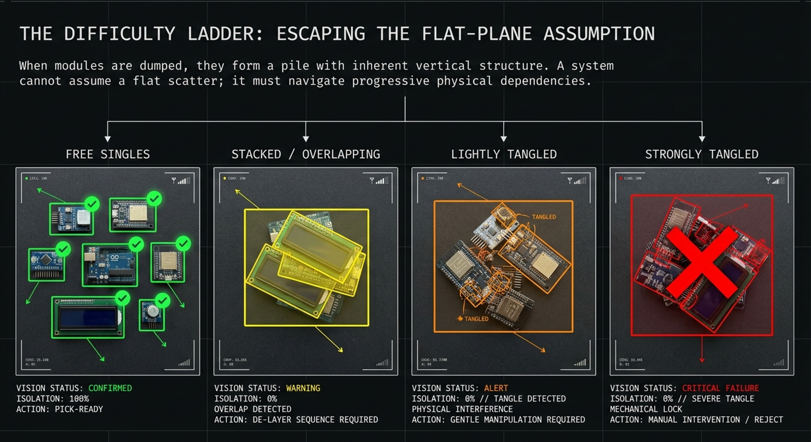
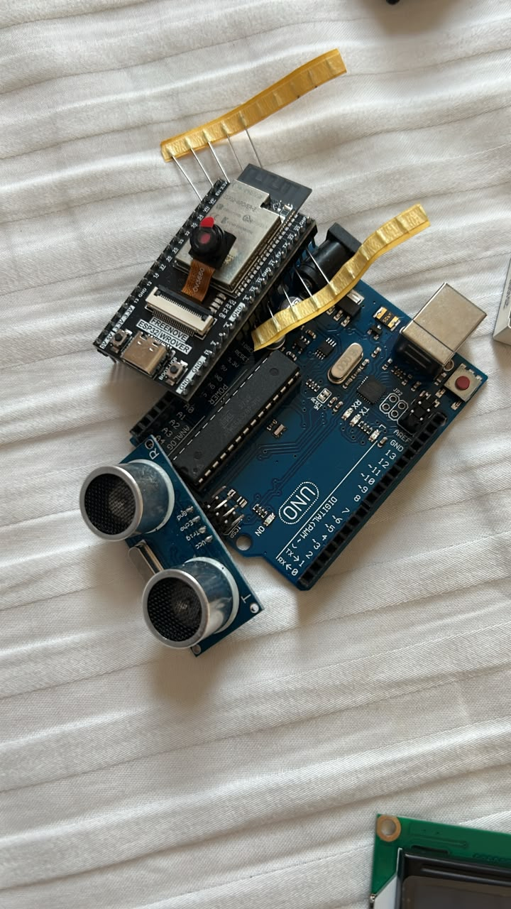
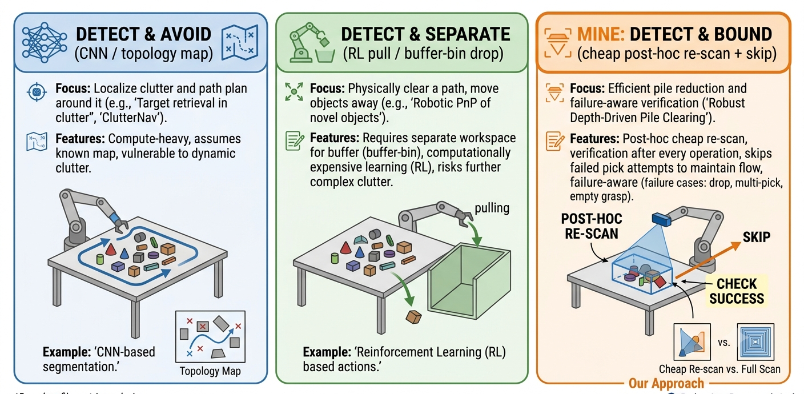

# Part 2: Entanglement

*[Part 1]() was about pick order. This part is about the thing that makes my object set genuinely unusual and the hard boundary of my whole project. When you tip a bucket of pin-headed modules onto a table, they don't just stack. They **hook into each other's GPIO pins**.*

## Why this cluster matters to me

My scene has a difficulty ladder: free singles, stacked/overlapping parts, and the **tangled** clusters that are interlocked. Topmost-first (Part 1) peels off the first two rungs. This cluster is about the last one.

*My scene as a difficulty ladder. Ordering handles the left; this entry is about the right where the pins interlock.*

One thing hit me immediately while reading: **the entanglement literature studies complex-shaped industrial workpieces** like hooks, C-clips, U-bolts, springs parts whose geometry naturally hooks together. **Nobody has studied the entanglement of small hobby PCBs through their header pins.** That's a gap I can own simply by characterising it.

*My own modules, tipped into a pile: the ESP32's long header pins drape straight across the Arduino UNO, with an ultrasonic sensor wedged alongside. It's exactly this protruding-header geometry that hooks parts together, the same interlocking failure the literature studies on complex metal workpieces, but on hobby PCBs nobody has characterised.*

## What the five papers do

I read these asking one question: *how do they handle interlocking parts, and what does it cost?* They split cleanly into two families.

**Family 1 — detect and AVOID (never grasp a tangle in the first place).**

- **Matsumura et al. (2019)** — the first paper to tackle "pick one *and only one* object from a tangled pile." Grasp candidates come from a graspability index; then a **CNN predicts whether a grasp would lift more than one object**, trained entirely in a physics simulator. Detect-then-avoid, learned.
- **Moosmann et al. (2020, Fraunhofer IPA)** — the same idea from the industrial side: a **CNN trained on simulated depth data predicts whether an entanglement is present** around a candidate grasp, so the system can pick the most reliable, non-entangled grip.
- **Zhang et al. (2021), "A Topological Solution"** — the interesting outlier. An **analytic "entanglement map"** built from topology coordinates on a single depth image — *no training, no object models* — that flags which regions likely contain tangled parts, and it *beats* the learned approaches on success rate. Cheaper than the CNNs, but still a bespoke topological computation.

**Family 2 — detect and SEPARATE (actively pull the tangle apart).**

- **Moosmann et al. (2021)** — rather than avoid, **learn to separate**: a deep-reinforcement-learning agent learns gripper motions that pull entangled parts apart, replacing the crude "shake the gripper over the bin" trick.
- **Zhang et al. (2023), PickNet / PullNet** — the most advanced. A network decides per-pixel whether to **pick an isolated object or separate a tangled one**, then disentangles by dropping into a buffer bin or **pulling** in a learned direction. 90% success, self-supervised in simulation.

## The common thread

Two honest takeaways. First, **entanglement is a real, distinct, hard failure mode**. Matsumura literally call theirs "the first trial on picking from a tangled pile," and every paper here needs serious machinery (physics simulators, CNNs, deep RL, or bespoke topology) just to *detect* it. Second, **actually separating tangles is the expensive, open end of the field** ,it takes learned manipulation and simulation infrastructure I don't have.

*Where I sit relative to the field: the literature either predicts-and-avoids tangles (Family 1) or learns to separate them (Family 2). I do neither expensively , I detect the tangle after the attempt with a re-scan, and bound the failure by skipping.*

## What this means for my project (Pillar 2)

This cluster is what turns my verification pillar from a nice-to-have into a necessity and it sets my honest boundary:

- **I detect, I don't separate.** Like Family 1, my system avoids committing to a tangle but even more cheaply. Instead of a trained CNN or a topology map predicting entanglement *before* the grasp, my **vision re-scan checks *after* the attempt**: did exactly one object leave, or did neighbours move together? A cheap, training-free, exteroceptive detector. The honest cost: I catch a tangle *after* a failed attempt, not before it.
- **Separation is scoped out.** Family 2 (RL pulling, buffer-bin dropping) is the "hardware, open problem" I'm *not* solving. My only concession is a single stretch goal disturbance nudge for *lightly* tangled parts.
- **My object class is new.** All five study complex-shaped industrial parts. Pin-header entanglement of PCBs is uncharacterised so even measuring *how often and how badly my parts tangle* is a contribution.

So Pillar 2's claim stays narrow and defensible: **detect entanglement cheaply, bound it honestly, and characterise it for an object class nobody has looked at.**

**Next (Part 3):** grasp verification & failure detection the machinery that makes "detect the tangle" work.

### References
- Matsumura, Domae, Wan & Harada (2019). *Learning Based Robotic Bin-picking for Potentially Tangled Objects.* IEEE/RSJ IROS.
- Zhang, Koyama, Domae, Wan & Harada (2021). *A Topological Solution of Entanglement for Complex-shaped Parts in Robotic Bin-Picking.* IEEE CASE. doi:10.1109/CASE49439.2021.9551426
- Moosmann, Spenrath, Kleeberger, Khalid, Mönnig, Rosport & Bormann (2020). *Increasing the Robustness of Random Bin Picking by Avoiding Grasps of Entangled Workpieces.* Procedia CIRP 93, 1212–1217.
- Moosmann, Kulig, Spenrath, Mönnig, Roggendorf, Petrovic, Bormann & Huber (2021). *Separating Entangled Workpieces in Random Bin Picking using Deep Reinforcement Learning.* Procedia CIRP 104, 881–886.
- Zhang, Domae, Wan & Harada (2023). *Learning to Dexterously Pick or Separate Tangled-Prone Objects for Industrial Bin Picking.* [arXiv:2302.08152](https://arxiv.org/abs/2302.08152)
