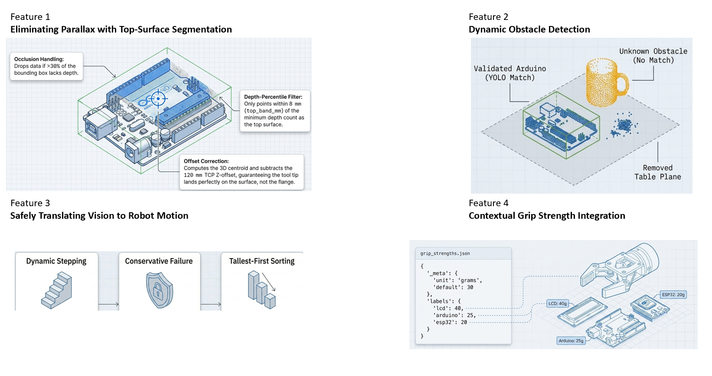

# 20/06/2026 — Initial Brainstorming

*First entry. This is where the project starts: a working bench system, a decision to take it further, and four ideas scribbled down before I'd spoken to anyone about them.*

## Where I'm starting from

For my PDE4445 dissertation I'm going to build on **Picker-Bot** — an existing computer-vision pick-and-place system I have access to, built around an **EPSON VT6-A901S** 6-axis industrial arm. Repository: [github.com/MrRox1337/picker-bot](https://github.com/MrRox1337/picker-bot).

In its current form Picker-Bot works like this: a single overhead **webcam** feeds a **YOLOv8-OBB** detector (oriented bounding boxes) that finds three classes of microelectronic module — Arduino, ESP32, and an LCD module — and a **one-plane homography** converts each detection's pixel position into a robot coordinate. The arm then descends to a **fixed height** (`robot_z = 360 mm`), closes the gripper, and lifts.

It genuinely works on the bench. But every assumption downstream of the detector is fragile, and my goal for this project is to take it toward something closer to **real-world deployment**. So before anything else, I sat down and asked: *if I actually trusted this thing to clear a real, messy workspace, what would have to be true that isn't true today?*

That question produced four ideas.

<video controls muted playsinline width="100%" style="max-width:640px;">
  <source src="img/pickerbot-legacy.mp4" type="video/mp4">
  Your browser does not support the video tag — <a href="img/pickerbot-legacy.mp4">download the clip</a> instead.
</video>

*The legacy Picker-Bot, end to end: the camera detects the Arduino with YOLO, sends a pick command to the EPSON arm, and the manipulator picks it up and drops it in the goal zone. This is the "before" state I'm building on.*

## The four features I want to add

*My first sketch of the four features. Each panel became one of the ideas below.*

### Feature 1 — Eliminate parallax with top-surface segmentation

The single biggest weakness today is the **fixed-height assumption**. The homography is calibrated once, at one camera height, and the arm always descends to the same `z`. That's fine for a flat object lying at the calibration height and wrong for anything else.

Two things break when an object is taller than expected:

- **Wrong descent depth** — the arm drives to 360 mm regardless of how tall the part actually is.
- **Parallax error** — an overhead camera sees the *top* of a tall object offset sideways from its true footprint on the table, so the homography hands back a laterally shifted pick point. The taller the part, the worse the shift.

My idea: add a **depth camera** (an Intel RealSense — I have a **D435i** in mind) running *alongside* YOLO, and compute the **true 3D centroid of each object's top surface** instead of a flat 2D point. The rough recipe I have in my head: inside each detection box, keep only the depth points within a small band of the *closest* surface (the top of the object), average them, and use that as the pick target — with an offset correction for the parallax. Partly occluded detections get filtered out if too few of their pixels return valid depth.

### Feature 2 — Dynamic obstacle detection

Right now the system has **no idea what else is on the table**. It sees the three classes it was trained on and nothing else. A mug, a cable, a stray part, my own hand — all invisible. In a real workspace that's a collision waiting to happen.

The depth camera gives me a way to fix this for free. From the same depth frame I can build a point cloud, fit and remove the **table plane** (RANSAC), and cluster whatever sticks up above it (DBSCAN). Then I cross-check those clusters against the YOLO detections: a cluster that **matches** a detection is a known, pickable part; a cluster that matches **nothing** is an **unknown obstacle** to avoid. Before each pick I can also check whether anything intrudes into the column of space the gripper needs to descend through, and lift the approach higher to clear it.

### Feature 3 — Safely translate vision into robot motion

The first two features produce *knowledge*; this one is about turning that knowledge into **safe motion** without over-promising. Three sub-ideas:

- **Dynamic stepping** — pass a per-pick clearance height to the robot so it lifts over obstacles instead of ploughing through them.
- **Conservative failure** — if a pick *can't* be made safely (an obstacle can't be cleared within the arm's limits), **skip it and log it**, then move on. A skipped pick is a good outcome; a crash is not.
- **Tallest-first ordering** — clear the tallest parts first, so a top-down approach to a short part isn't blocked by a taller neighbour beside it.

Mechanically this is a small, backward-compatible extension to the existing robot command — an optional clearance field on the `PICK` message — so the current pipeline keeps working untouched.

### Feature 4 — Contextual grip-strength integration

Not every module wants the same squeeze. An LCD with a glass panel and a bare ESP32 board shouldn't be gripped with identical force. The idea here is a simple **per-label lookup table** of grip strength (grams) keyed on the detected class, with a sensible default for anything unknown.

For now this is **reporting only** — the current gripper has no force control, so I'll *log* the intended grip strength rather than command it. It documents the intent and leaves a clean hook for later, when a force-capable end-effector exists.

## A note on hardware

I don't have the depth camera in hand yet. Rather than let that block me, my plan is to build the whole depth pipeline against an **abstraction over the frame source** — live camera, a recorded `.bag` file, or saved `.npy` frame pairs so I can develop and test everything *without* hardware and swap in the real camera when it arrives. That keeps the hardware off my critical path.

## Where I think this could get hard

Writing these down honestly, a few worries are already obvious:

- Depth cameras are **noisy on small, thin, shiny parts** — exactly what these modules are. Glossy LCD glass in particular may not return clean depth.
- The camera and robot need a proper **hand-eye calibration** for any of this to be accurate that's a task in itself.
- I'm not yet sure how *messy* a scene I should be aiming for. "Real-world deployment" is a big phrase and I need to pin down what it actually means for this project.

## Next step

I've got my supervisor meeting with **Dr. Sameer** coming up. My plan is to bring these four features to that meeting and test the framing *is this the right problem, and is it framed in a way that "feels right"?* — before I commit to a formal proposal.

→ *Continued in the [next entry](): the initial meeting with Dr. Sameer.*
