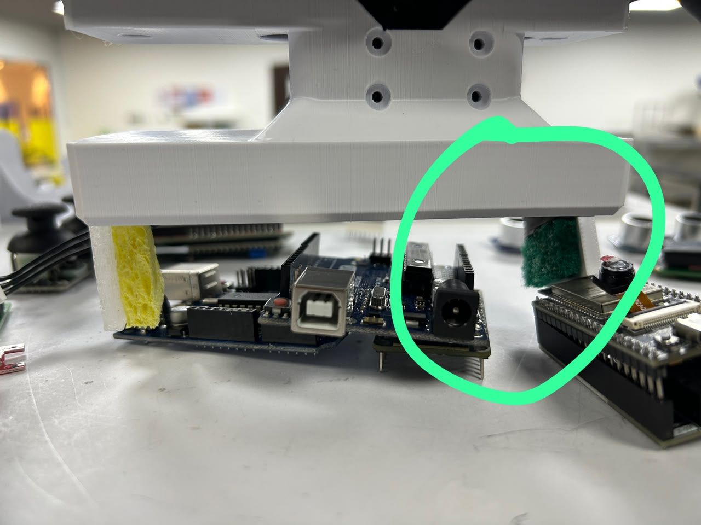
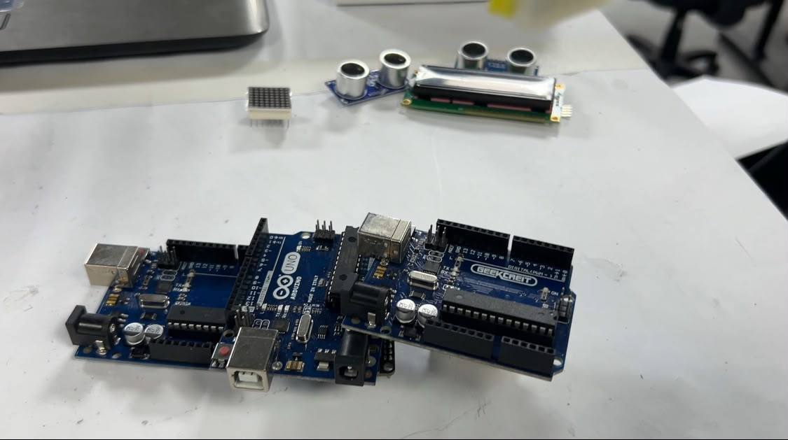
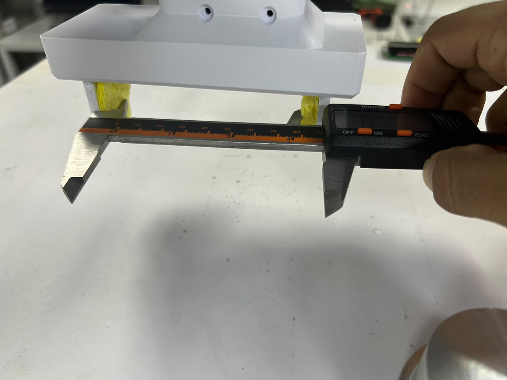
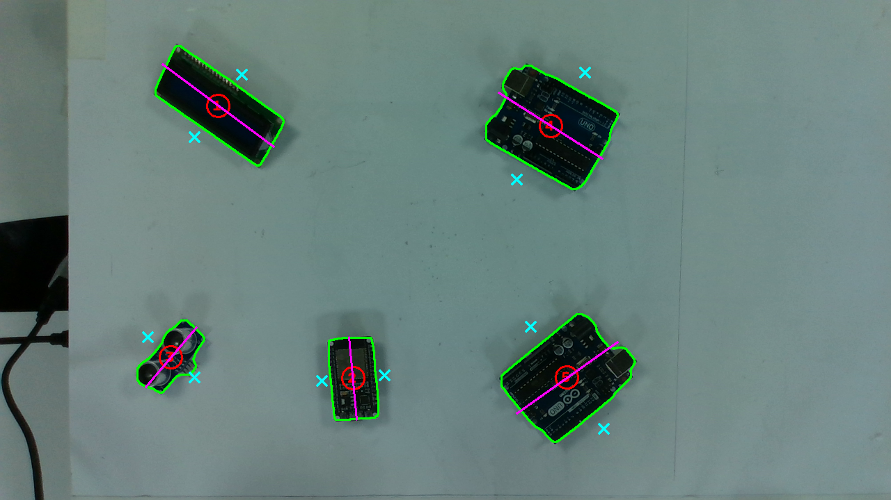

# A week of debugging and every class finally grips

*[Previously,]() only the Arduino was provably grippable. This week: a crushed part, a clutter bug, and a root-cause fix that made every class grip.*

## The crush

Firm enough for an Arduino is too much for an esp. The fix had to know a part's **width** before closing, not just its class.

## The roof tile

Height was read from the nearest depth pixel, and depth bleeds across edges an esp resting on an arduino both read `z=261`. Switching to the **median depth over the whole mask** (`--z-ref med`) split them by 8.7 mm.

## Measuring it properly

`ticks = 25.983 × gap_mm + 758.4`, RMS 0.12 mm — turned into a per-part aperture on every detection:

*Each X is the gripper's computed finger position for that part's width — not a fixed gap for every class.*

Cross-checked against where each class actually stalls, the padding compresses by a near-constant amount regardless of part size:

| Class | True width (mm) | Compression (mm) |
|---|---|---|
| ultrasonic | 16.0 | 10.5 |
| lcd | 25.0 | 10.2 |
| esp | 28.0 | 9.6 |
| arduino | 53.4 | 11.0 |

A grip check became a **size** check, not just a hold check.

## The real fix

The servo had been driven below its own usable current range for the whole project — 80–90 raw, when the linkage needs 100+ just to make contact. Below that, empty fingers stall at ~1646 regardless of what's in front of them wider than any of the four classes. That's why esp and lcd ever looked "unobservable": they were never actually being gripped.

> Corrected to grip 100 / open 120: **all four classes now separate cleanly from an empty close.** The Arduino-only limitation from [sept-1.md]() is gone.

## What the safety net is worth

Same four-part layout, per-pick re-scan on vs. off:

| | Per-pick re-scan | Single initial scan |
|---|---|---|
| **Topmost-first** | 4/4 (100%) | 2/4 (50%) |
| **Naive raster** | 4/4 (100%) | aborted .I stopped a collision |

> Depth ordering and re-scan verification aren't separable. The loop is what makes the system work; ordering is what makes the loop safe.

## On video

  <iframe src="https://www.youtube.com/embed/VIll0JfEFBI" title="Width-aware clutter picking — Picker-Bot, September 2026" style="position:absolute;top:0;left:0;width:100%;height:100%;border:0;" allow="accelerometer; encrypted-media; gyroscope; picture-in-picture" allowfullscreen></iframe>

*[Watch on YouTube ↗](https://youtu.be/VIll0JfEFBI?si=a6MhtOY2d9XMNRgL) lcd and Arduino picked cleanly; the same clip also shows a failed esp attempt, left in.*

## Where this leaves me

Every class grips now, and the ordering-vs-verification result reframes both pillars as one argument.

**Next:** BOQ demo + low-light, PnP accuracy + more ablation pairs, buffer session.
